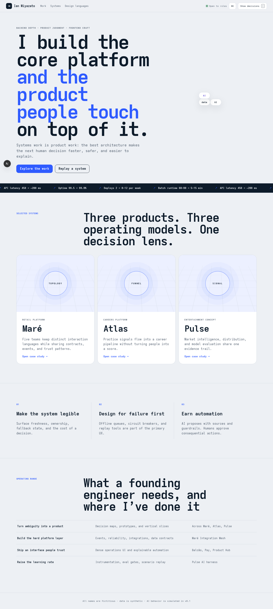
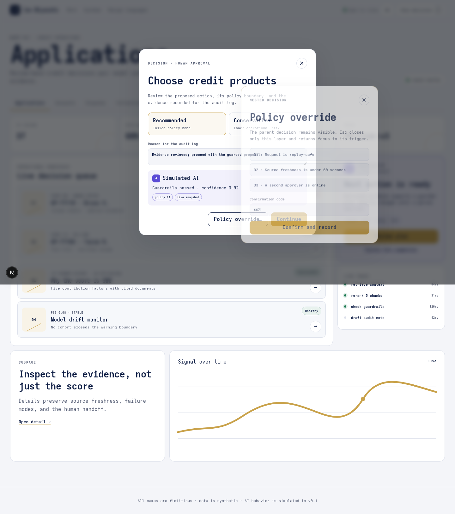
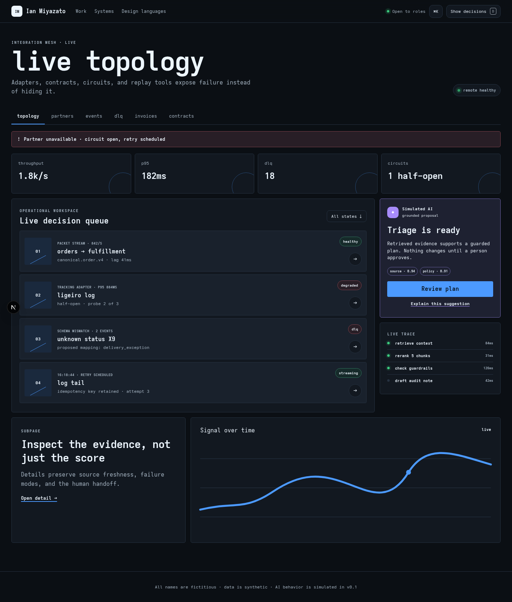
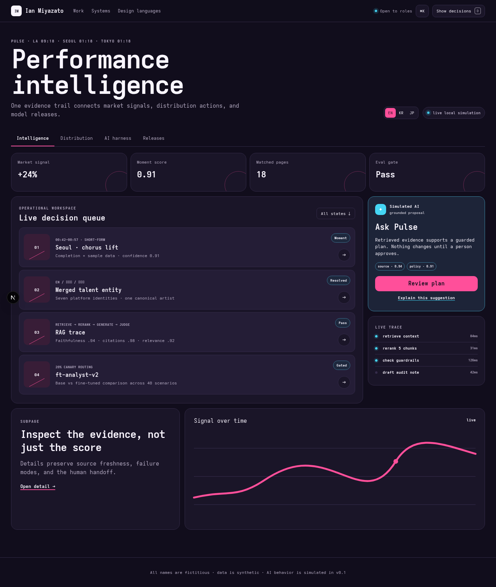
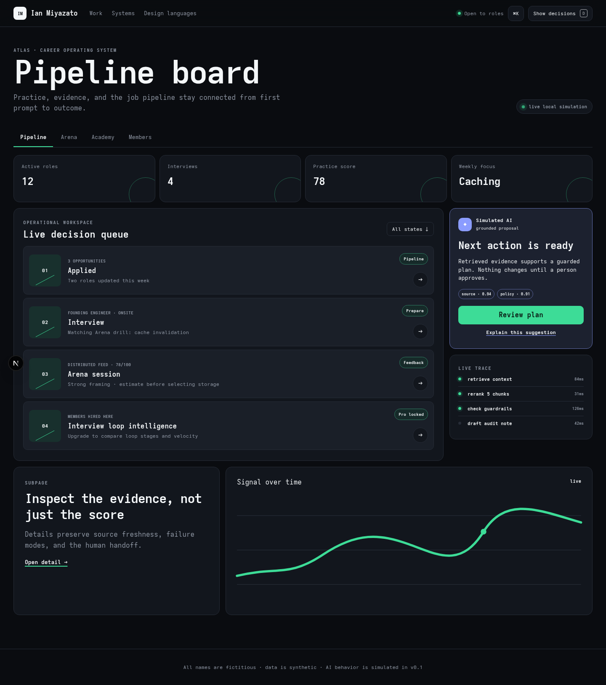
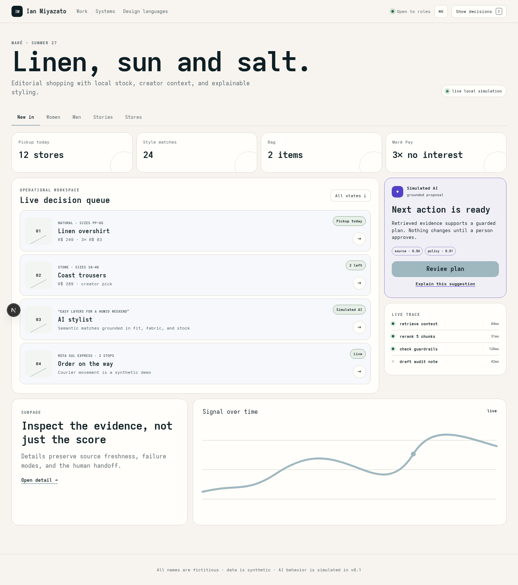

# Ian Miyazato · systems portfolio

Design, UI/UX, and architecture across three synthetic platforms. **Production deployment pending:** add `VERCEL_TOKEN` to `.env.agent` and run `pnpm deploy:all`.

## Screenshot gallery

The gallery is generated by `pnpm screenshots` at 1440 × 900.

| Home | Maré Pay · nested decision |
|---|---|
|  |  |
| Integration Mesh · failure state | Pulse · intelligence |
|  |  |
| Atlas · pipeline | Maré shop |
|  |  |

The complete set also covers Balcão, Product Hub, Circle, and the Maré system-design replay.

## Reviewer tour

1. Open `/` and scan the operating metrics and project previews.
2. Open `/system-design/mare`, select **Black Friday spike**, and play the scenario.
3. Visit `/mare/ops/balcao`, open **Review plan**, then apply it. Continue to `/mare/ops/pay/applications/AP-77118?modal=decision&sub=override`.
4. Visit `/mare/ops/mesh?state=error` to inspect a carrier circuit opening.
5. Visit `/mare/shop`, then open the linen product detail and bag.
6. Visit `/atlas/arena`, open a session, then inspect the feedback report.
7. Visit `/pulse`, ask Pulse a question, and open the trace.
8. Press `D` anywhere to reveal the decision lens.

## Architecture

```text
single domain / shell
├── /mare/ops/*  → Vite host + five runtime remotes
├── /mare/shop/* → Astro consumer experience
├── /mare/apps/* → Astro + React islands
├── /atlas/*     → Next.js shell zone
└── /pulse/*     → SvelteKit real-time zone
        │
        └── shared contracts: tokens · events · AI simulation · decision lens
```

The checked-in shell provides a complete local reviewer experience for every route while the independent zone packages remain deployable boundaries. `microfrontends.json` records the current Vercel routing model; `apps/shell/next.config.ts` keeps rewrite-compatible deployment settings.

## Run locally

```bash
corepack enable
corepack prepare pnpm@10.17.1 --activate
pnpm install
pnpm dev
```

Open <http://localhost:3000>. Run `pnpm check` for lint, strict TypeScript, unit tests, and production build. Run `pnpm e2e` for Chromium interactions and axe checks.

All names are fictitious · data is synthetic · AI behavior is simulated in v0.1.
