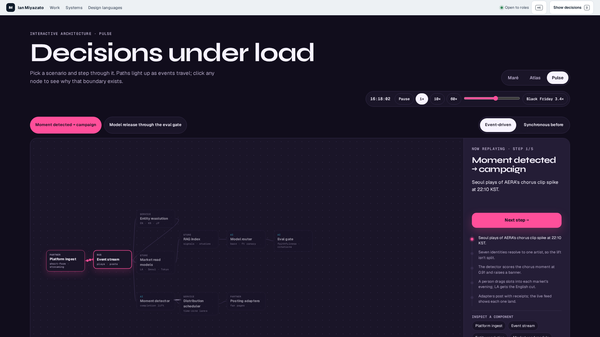
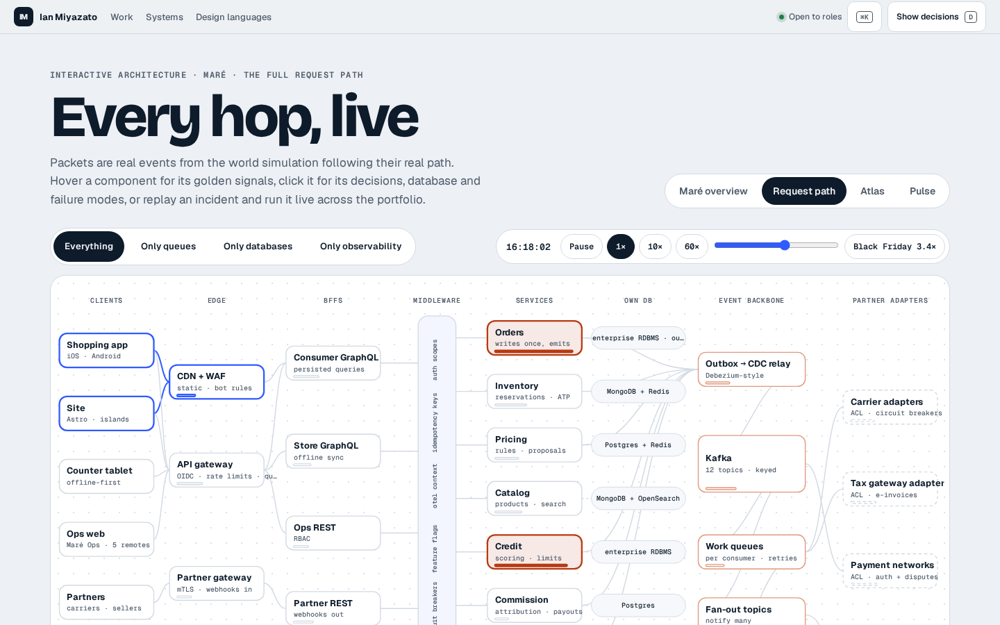
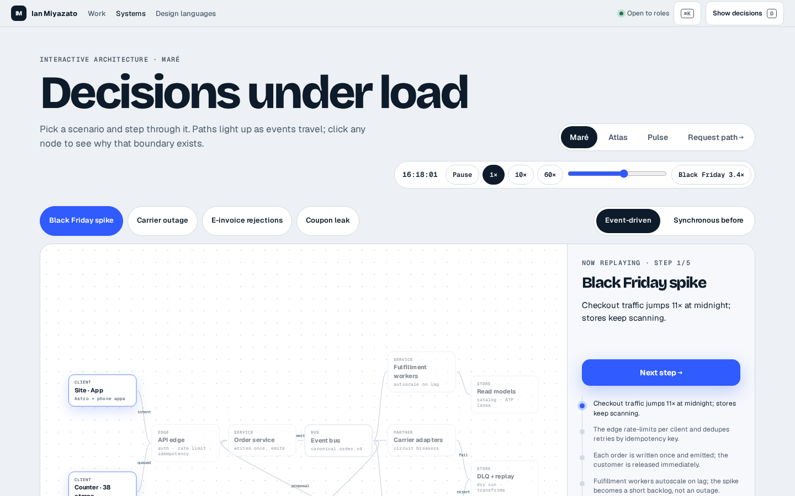

# System design audit · v1 (before)

Audited 2026-09-29 on the local production build of v0.2.0 (`develop` at `79e3a21`), all four zones behind the shell on `:3000`.

**Tooling.** Chrome DevTools MCP is still unavailable here ("Could not find Google Chrome executable for channel 'stable'"), so the audit runs the same measurements in Playwright Chromium: `LABEL=system-design-v1 node scripts/sd-audit.mjs`. For each page it takes screenshots at 1440 × 900 and 1920 × 1080 and under reduced motion. It records a 10-second Chromium performance trace while the replay steps every 2.5 s, plus console errors, axe (WCAG 2.1 A/AA), CLS, rendered text sizes, text overlaps, chromatic colors, jargon, packet jumps, and whether anything keeps moving off-screen or in a hidden tab. Raw numbers: [system-design-v1.json](system-design-v1.json).

## Pages

| Page | What it is | JS (gzip, from `docs/agents/js-budgets.json`) |
|---|---|---|
| `/system-design/mare` | React Flow diagram, 11 nodes, 4 scenario replays, "synchronous before" toggle | 169.7 kB (budget exception) |
| `/system-design/mare/request-path` | Hand-laid SVG, 30 nodes in 8 lanes, live packets from the world simulation, 5 replays | 125.6 kB |
| `/system-design/atlas` | Same React Flow component, 10 nodes, 2 replays | 169.7 kB (budget exception) |
| `/system-design/pulse` | Same React Flow component, 10 nodes, 2 replays | 169.7 kB (budget exception) |

The v2 target is **≤ 60 kB per route**. No Next.js route can reach it, because the React runtime alone is about 60 kB.

## Measurements

| | mare | request-path | atlas | pulse |
|---|---|---|---|---|
| Console errors | 0 | 0 | 0 | 0 |
| axe serious/critical | 0 | 0 | 0 | 0 |
| CLS (load → after 4 steps) | **0.394** → 0.394 | 0.014 → 0.014 | 0.015 → 0.015 | 0.012 → 0.012 |
| Long tasks > 50 ms in the 10 s trace | 0 (longest 8 ms) | 0 (6 ms) | 0 (8 ms) | 0 (8 ms) |
| Long tasks during load (PerformanceObserver) | 77 ms | 67 ms | – | 52 ms |
| Frames in 10 s (dropped > 25 ms) | 601 (0) | 601 (0) | 601 (0) | 601 (1, worst 32 ms) |
| Smallest rendered diagram text | **7.3 px** | **9.1 px** | **7.3 px** | **7.3 px** |
| Diagram text under 14 px | 28 of 39 | **91 of 91** | 24 of 33 | 21 of 31 |
| SVG `viewBox` | none (JS fitView) | `0 0 1410 880` | none | none |
| Packets moving at once (after 2 steps) | **12** | 1–20 (event-driven) | 6 | **12** |
| Largest packet jump between frames | **96 px** | 9 px | **212 px** | **190 px** |
| Animations still running off-screen | **6** | **4** | **3** | **9** |
| Animations still running in a hidden tab | **6** | **4** | **3** | **9** |
| Jargon words in the primary layer | 12 | **23** | 3 | 1 |
| Chromatic colors in the diagram | 2 | 3 (+ red failed state, AI violet) | 2 | 2 |

## Findings

Severity: **S1** blocks a live presentation · **S2** hurts comprehension or credibility · **S3** polish.

| # | Page | Element | Finding | Severity | Evidence |
|---|---|---|---|---|---|
| 1 | all | Whole page | **Not for a non-technical audience.** The primary layer is written for engineers: "idempotency key", "canonical.order.v4", "DLQ", "circuit", "CDC", "Kafka", "p95", "RAG". There is no plain layer and no engineering toggle. | S1 | jargon row above |
| 2 | mare, atlas, pulse | React Flow canvas | **Text is 7–10 px on screen.** fitView scales 168 px nodes down, so kind labels, subtitles and edge labels render at 7.3 px. They're unreadable on a shared screen. | S1 |  |
| 3 | mare, atlas, pulse | React Flow canvas | **The diagram sits in the lower-left of a mostly empty canvas at 1920 × 1080.** The canvas grows with the aside, and fitView fits the graph into the top-left area. At 1440 the diagram starts below the fold (y ≈ 440). | S1 |  |
| 4 | mare, atlas, pulse | `.sd-packet` | **Packets jump.** Each lit edge runs 3 packets on a 1.8 s infinite loop that snaps from the end of the path back to its start (up to 212 px in one frame). Every edge seen so far keeps animating, so later steps have 12 packets on 4–6 edges and no single focus. | S1 | packet rows |
| 5 | mare | React Flow viewport | **CLS 0.394**: the graph renders, then fitView and the font swap move it. | S2 | CLS row |
| 6 | request-path | SVG | **Too much at once.** 30 nodes, 8 lanes, a rotated middleware band, database pills and an observability plane are all visible together. All 91 text nodes are under 14 px, and several labels are truncated with "…" ("enterprise RDBMS · ou…", "OIDC · rate limits · qu…"). | S1 |  |
| 7 | all | Motion | **Nothing pauses.** No IntersectionObserver and no `visibilitychange` handling: 3–9 animations keep running with the diagram off-screen or the tab hidden. | S2 | off-screen rows |
| 8 | all | Replay | **Replays can only be clicked forward.** There are no keys, no Back, no pause, no Home/End and no `?step=` URL, so a presenter can't return to a step or share a link to one. | S1 | – |
| 9 | request-path | Live packets | Packets spawn through React state on world events (about 3 DOM mutations per second, with a 1 s re-render of every node's signals). The motion itself is CSS `offset-distance`, but spawning and removal go through React. | S3 | motion row |
| 10 | all | Reduced motion | Nothing moves, which is correct, but packets are removed rather than shown as direction markers, and the request path's "live" behavior disappears without a replacement. | S3 |  |
| 11 | atlas | Edge label | "entitlements" overlaps the Pipeline service node. Edge labels on all React Flow pages sit on top of the edges they label ("emit", "moment"). | S2 | overlap row |
| 12 | all | Header | Two rows of controls (project switcher, world clock with 1×/10×/60×, a scrubber and Black Friday, scenario pills, event/sync toggle) above the diagram. It's a control panel, not a story. | S2 | screenshots |
| 13 | all | Metrics strip | The before/after metrics are real and allowed, but they sit under a diagram of a fictitious company with no link between the number and the step that earned it. | S3 | – |
| 14 | mare, atlas, pulse | Bundle | 169.7 kB of JS (React Flow) to draw 10 static boxes. | S2 | JS table |
| 15 | pulse | Frames | One 305 ms frame gap while stepping (a React Flow re-layout after a click). It isn't a long task in the trace, but you can see it on screen. | S3 | frames row (first run) |

Checks that passed: zero console errors, zero serious/critical axe violations, no long tasks during animation, 60 fps between steps, and every animation uses `offset-distance` or `opacity` (never layout properties).

## Ranked fix list

1. **Replace the story.** Two problems (metrics to decisions; personal and instant) told in plain language, with the engineering detail one key away (findings 1, 12, 13).
2. **One small engine for every diagram.** An SVG `viewBox` on a 12-column grid, 16 px minimum plain text, and one focused step at a time. It needs keyboard control, `?step=`, pause, reduced motion that shows each step's final state, and off-screen/hidden pause (findings 2, 3, 7, 8, 10).
3. **Packets that never jump.** At most 3, only on the focused edges, played once per step along the real path. No infinite loop means no snap back to the start (finding 4).
4. **Static and light.** Move system design to the static Astro zone to stay under 60 kB per route and reach CLS 0 with reserved sizes (findings 5, 14).
5. **Retire what can't reach the bar.** Rebuild the Maré overview on the engine as the one engineering deep dive. Fold the request path into it. Redirect the Atlas and Pulse pages, whose content is covered by the two problems, to the index (findings 6, 9, 11, 15).
