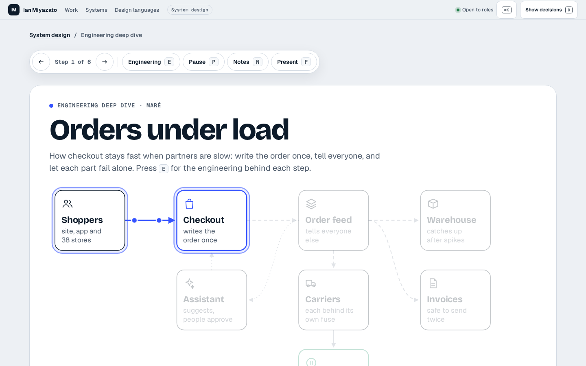
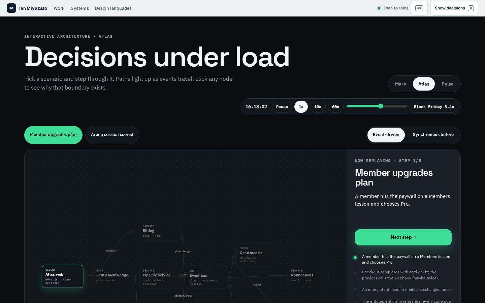
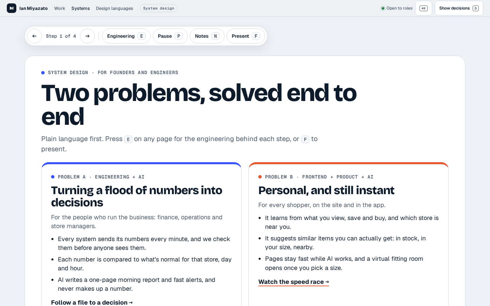
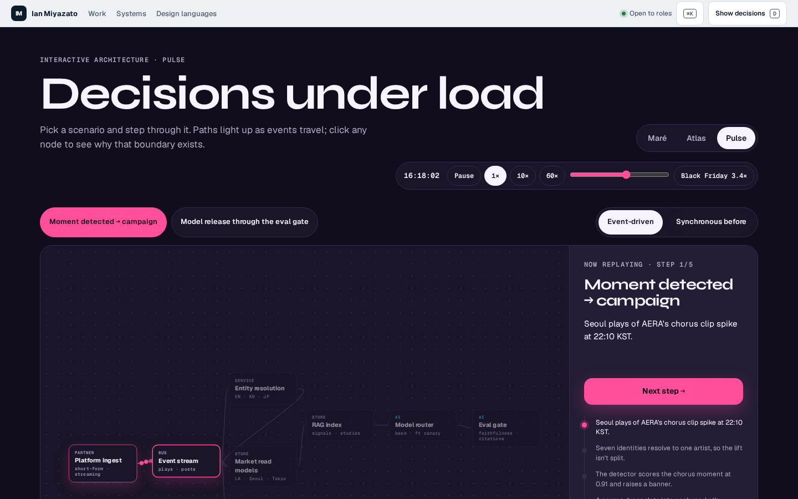
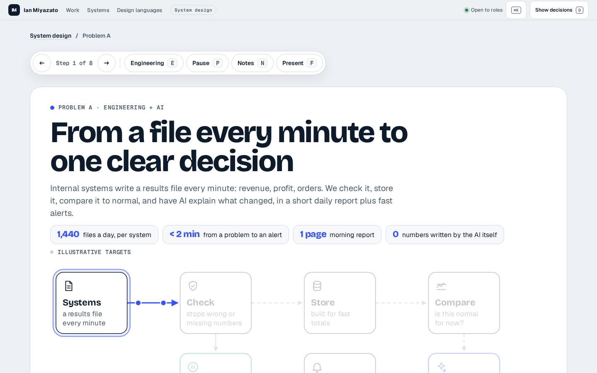

# System design audit · v2 (after)

Audited 2026-09-29 on the local production build of v0.3, with all four zones behind the shell on `:3000`.

**Tooling.** Chrome DevTools MCP is still unavailable here because Chrome stable is not installed, so the repeatable fallback uses Playwright Chromium, CDP tracing, `PerformanceObserver` and axe: `LABEL=system-design-v2 PATHS=… node scripts/sd-audit.mjs`. Each live route was captured at 1440 × 900, 1920 × 1080 and under reduced motion. The trace walks every step at 2.5-second intervals. Raw measurements: [system-design-v2.json](system-design-v2.json). Every presentation step is also captured at both sizes under [the step gallery](../screenshots/system-design/steps/).

## Result

All S1 and S2 findings from v1 are resolved. The system-design experience is now seven static routes with 36 URL-addressable steps, plus three permanent redirects for retired pages. The plain layer tells two problems; `E` reveals the engineering layer; `?present=1` turns the same pages into an eight-screen call deck.

| Route | Steps traced | Trace | Frames | CLS load → after steps | Console | axe serious / critical | JS gzip |
|---|---:|---|---|---:|---:|---:|---:|
| `/system-design` | 4 | 0 tasks >50 ms; longest 2 ms | 60 fps; worst 24 ms | 0 → 0 | 0 | 0 | 8.5 kB |
| `/system-design/metrics-to-decisions` | 8 | 0 tasks >50 ms; longest 3 ms | 60 fps; worst 21 ms | 0 → 0 | 0 | 0 | 8.8 kB |
| `/system-design/metrics-to-decisions/build-or-buy` | 3 | 0 tasks >50 ms; longest 6 ms | 60 fps; worst 26 ms | 0 → 0 | 0 | 0 | 8.6 kB |
| `/system-design/personal-and-instant` | 8 | 0 tasks >50 ms; longest 5 ms | 60 fps; worst 24 ms | 0 → 0 | 0 | 0 | 10.6 kB |
| `/system-design/personal-and-instant/build-or-buy` | 3 | 0 tasks >50 ms; longest 3 ms | 60 fps; worst 21 ms | 0 → 0 | 0 | 0 | 8.6 kB |
| `/system-design/build-vs-buy` | 4 | 0 tasks >50 ms; longest 2 ms | 60 fps; worst 22 ms | 0 → 0 | 0 | 0 | 8.9 kB |
| `/system-design/mare` | 6 | 0 tasks >50 ms; longest 4 ms | 60 fps; worst 21 ms | 0 → 0 | 0 | 0 | 8.6 kB |

The trace window is 10 seconds for three- and four-step pages, 15 seconds for Maré and 20 seconds for both problem pages. The frame sampler saw two gaps over 25 ms on Problem A build-or-buy (worst 26 ms) and none on the other six routes. Four cold loads emitted one observer long task each before the trace began (52–68 ms); no long task occurred while any step animated.

## Motion, readability and honesty

- Diagram labels are 22 px and plain captions are 17 px in the SVG at 1440 wide. The 14 px audit minimum is secondary metadata and controls; no rendered text is below 14 px.
- Animated routes run at most two packets at once, only on focused edges. The largest between-frame movement is 2 px and there are zero loop jumps.
- Motion uses only `offset-distance` and opacity, with zero per-frame DOM mutations. Off-screen and hidden-tab running animation counts are zero on every route.
- Reduced motion has zero running animations and keeps the focused nodes, direction markers and complete caption visible.
- The plain-language lint passes. The raw browser audit reports `SQL`, `API` and `edge` on build-or-buy cards because those exact approved decisions name standard interfaces; story captions remain jargon-free. Maré's technical words are confined to the `E` layer.
- The raw overlap heuristic counts stacked inactive captions and plain/engineering labels that deliberately share one reserved box. Screenshots and the active-step browser checks show one layer at a time; no visible label collision remains.
- Every target timing and volume is marked illustrative. The report's numbers are generated first, the simulated AI writes only prose, a checker verifies the sentence, and a person approves the action.

## Before → after: older pages

### Maré

Before, `/system-design/mare` used React Flow: 7.3 px minimum diagram text, 12 simultaneous packets, CLS 0.394, six animations still running off-screen, 12 primary-layer jargon terms and 169.7 kB gzipped JS.

After, it is a six-step engineering deep dive on the story engine: CLS 0, 17 px plain diagram captions, at most two packets, zero off-screen/hidden motion, keyboard and URL control, reduced motion, and 8.6 kB gzipped JS.

| Before | After |
|---|---|
|  |  |

### Request path

The old request path placed 30 nodes in eight lanes; all 91 labels rendered below 14 px. Reproducing that density would violate the one-idea-per-step rule, so `/system-design/mare/request-path` now returns a permanent 308 to the rebuilt Maré deep dive. Its incident evidence still lives in Tidewatch.

| Before | After the redirect |
|---|---|
|  |  |

### Atlas

The old Atlas architecture page rendered 24 of 33 diagram labels below 14 px and offered no plain layer or usable replay controls. It did not serve either of the two new problems, so `/system-design/atlas` now returns a permanent 308 to the two-problem index.

| Before | After the redirect |
|---|---|
|  |  |

### Pulse

The old Pulse architecture page rendered 21 of 31 diagram labels below 14 px and ran nine animations off-screen. Its performance-intelligence lesson is Problem A, so `/system-design/pulse` now returns a permanent 308 to metrics-to-decisions.

| Before | After the redirect |
|---|---|
|  |  |

## Lighthouse and browser gates

Lighthouse 12.6.1, default mobile simulated throttling, median of three local-production runs:

| Page | Performance | Accessibility | Best practices | SEO | LCP |
|---|---:|---:|---:|---:|---:|
| `/system-design` | 100 | 100 | 100 | 100 | 1.813 s |
| `/system-design/metrics-to-decisions` | 100 | 100 | 100 | 100 | 1.813 s |
| `/system-design/personal-and-instant` | 99 | 100 | 100 | 100 | 1.814 s |

Measured gates on the final build:

- `pnpm check`: lint, typecheck, unit tests and all production builds pass.
- Story behavior: 40/40 pass across the engine and route suites, including the direct-presentation CLS regression.
- axe: 7/7 live route suites walk every step with zero serious or critical violations.
- Screenshot gate: 14/14 route × viewport jobs pass and write 72 step images (36 steps at two sizes). The live demo screenshot path asserts its visible CLS readout is `0.000`.
- JavaScript budgets: 43/43 repository checks pass; all seven system-design routes are 8.5–10.6 kB against 60 kB.
- Manifest verifier: 7/7 live system-design routes load with the expected heading and zero console errors.
- Redirect gate: request path, Atlas and Pulse return 308 and land on their intended replacement.
