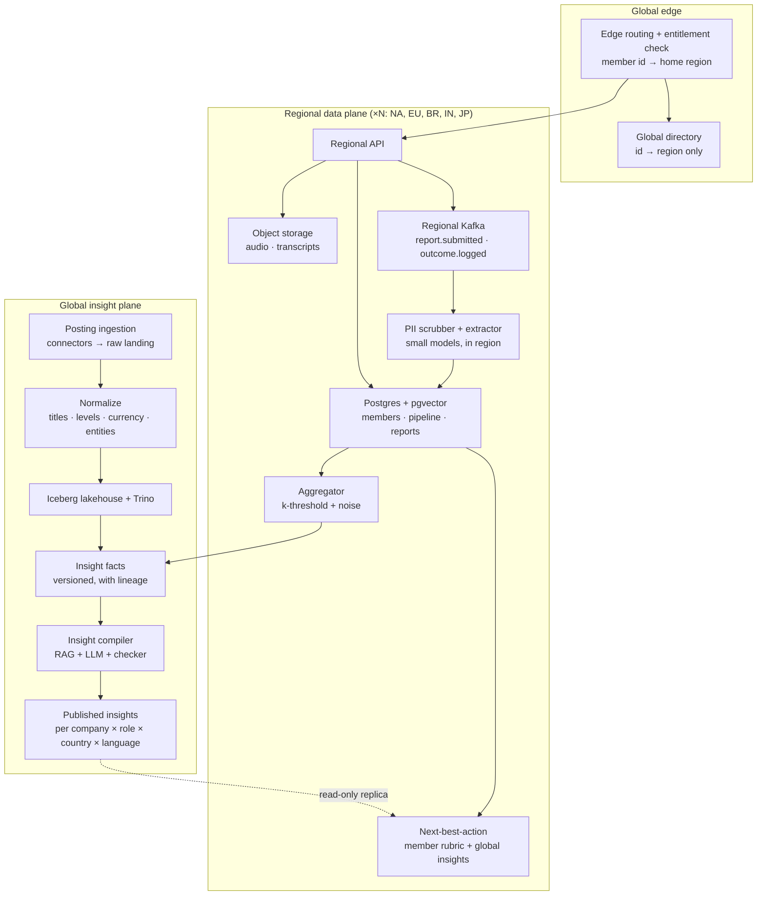
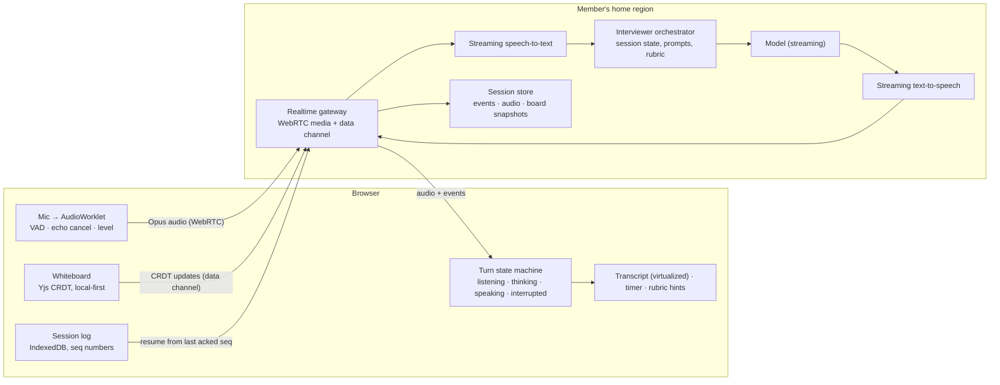

# ATLAS

← [All cases](README.md) · [Maré](mare.md) · [Pulse](pulse.md) · [Learning map](learning-map.md)

## System context

Atlas is a career operating system for engineers. Practice, learning and the job search feed each other instead of living in three tabs:

- **Pipeline** tracks applications, interviews and offers, with company pages showing hiring velocity.
- **Arena** runs AI mock interviews with graded, cited feedback: *"at 31:30 you sized storage without a write rate"*.
- **Academy** turns real interview loops into seasons ("Parallax Pay: The Loop"), built from member reports. It also offers lessons, a daily Practice Mix, live mocks with mentors and an offer wallet.

Two measured results so far: Feature adoption +30–40% and Dashboard load 2.8 s → 1.2 s.

**What the business earns from:** paid memberships (Academy depth, unlimited Arena sessions, loop intelligence), mentor sessions and, later, employer partnerships. The paywall converts when the product has *specific knowledge about the member's next interview*: "Parallax Pay asked idempotency in 9 of 14 member reports". That knowledge is Atlas's moat.

**Where members are:** engineers apply to companies in many countries. The case assumes members in `[value]` countries, concentrated in North America, the EU, Brazil, India and Japan, each with its own language, pay norms and privacy law.

---

## Backend core problem

### Many countries, one set of insights

> **How do we turn job postings and member interview reports from many countries into trustworthy, localized insights and next steps, when personal data must stay in the member's home region and the AI bill must stay under control?**

Why this is the most valuable backend problem for Atlas in 2026 Q4:

1. **The insight is the product.** Loop seasons, company pages and next-best-action are what members pay for. Better coverage (more companies, roles and countries with enough reports) should lift paid conversion `[value]`.
2. **The data is personal and it crosses borders.** An interview report says who interviewed where, how it went and what they were offered. Privacy law (the EU's GDPR, Brazil's LGPD, India's DPDP Act and others) restricts where that data lives and what may leave. A single global database is the simplest design, and the one that closes markets.
3. **Small samples leak identities.** "The one Staff engineer who interviewed at a 40-person startup in Lisbon last month got R$…" identifies a person. Insights need a privacy threshold, not just access control.
4. **Countries differ in the data itself.** Titles and levels don't map one-to-one. Salaries may be monthly or annual, gross or net, with a 13th salary in Brazil or a large bonus share in Japan. The same company appears under several legal names.
5. **AI over large data costs money.** Generating insights per company × role × country × language is a lot of model work. It must be incremental, batched and checked.

**The metrics:**

- **Paid conversion.** Members who see loop intelligence for a company in their pipeline.
- **Insight coverage.** The share of member pipeline companies with a published, threshold-safe insight.
- **Report contributions per member.** The flywheel: trust leads to more reports, which lead to better insights.
- **Cost per published insight**, and **regulatory exposure**, whose target is zero cross-border personal data.

---

## Backend technical system design

### The core idea: regional data planes, one global insight plane

Data is classified by **what it is**, and the class decides where it may live.

| Data class | Examples | Where it lives | May cross borders? |
|---|---|---|---|
| **Personal** | account, pipeline, Arena audio and transcripts, interview reports, offers | the member's **home region** | no |
| **Pseudonymous derived** | per-report structured fields (round type, topic, outcome), without identity | the home region | no, only as aggregates |
| **Aggregate, threshold-safe** | "topic X asked in 9 of 14 reports", salary band p25–p75 for n ≥ k | **global insight plane** | yes |
| **Public** | job postings, company facts, Academy content | global | yes |
| **Routing** | member id → home region | global directory (minimal) | yes, by design and disclosed |



### Regional data plane (one per residency region)

- **Home region** is chosen at signup from the member's country. It changes only through an explicit migration workflow that copies, verifies and then deletes the source.
- **The edge** routes every authenticated request to the home region using a signed token that carries the region. The global directory (id → region) is consulted only on login and on token refresh.
- **Postgres + pgvector** holds members, pipeline, reports and embeddings of the member's own content in one engine per region. Report dedupe and "similar questions" need vectors; running a separate vector database in every region would multiply operations for no gain at this scale.
- **Object storage** holds Arena audio and transcripts, encrypted with per-region keys, with retention policies by data class.
- **Regional Kafka** carries `report.submitted`, `outcome.logged` and `session.graded`, the events that change a member's plan. The existing "event-driven plan changes" live here.
- **The PII scrubber and extractor** turn a free-text report into structured, pseudonymous fields: company, role, level, round type, topics, difficulty, outcome, offer band. They run on **small open-weights models hosted in the region** (plus rules for emails, phone numbers and names), so raw text never goes to a model outside the region.
- **The aggregator** publishes only aggregates that pass the **privacy threshold**:
  - at least *k* reports from at least *m* distinct members in the cell (company × role × country × window);
  - salary percentiles get calibrated noise;
  - small cells are **merged upward** (country → region, role → family) instead of dropped.

### Global insight plane

- **Posting ingestion.** Connectors read employers' career pages, applicant-tracking feeds and partner feeds, each with a schedule and a request budget. Raw payloads land unchanged in object storage (immutable, replayable), then pass through the normalizer.
- **Normalization.**
  - *Language detection.*
  - *Title and level mapping* to a canonical taxonomy. An LLM classifier outputs a level plus a confidence score; low-confidence items go to a human review queue, and reviewed items become training and evaluation data.
  - *Salary normalization* to annual gross in local currency plus a reference currency, with country rules for 13th salary, bonus share and gross vs net.
  - *Company entity resolution*: "Parallax Pay Ltda", "Parallax Pay, Inc." and "parallaxpay.com" are one company, matched on name, domain and embedding similarity, with human confirmation for merges.
- **Lakehouse (Iceberg + Trino).** Postings, normalized entities and regional aggregates live in versioned tables. Every insight can be recomputed from a known snapshot, and analysts query it without touching production.
- **Insight facts** are the numbers, computed by SQL: topic frequencies, pass rates per round, hiring velocity, salary bands, time-to-offer. Each fact carries lineage: source aggregates, window, sample size and snapshot id.
- **The insight compiler** writes the words (details below).

### The insight compiler: numbers first, AI writes the words

```text
for each dirty cell (company × role × country) since the last run:
  facts    = SQL over the lakehouse snapshot           # numbers, never generated
  context  = retrieve(Academy lessons, prior season text, public postings) # RAG
  draft    = model.write(facts, context, style guide, target language)     # prose with fact ids
  checks   = every number in draft ∈ facts; every claim cites a fact id;
             no cell below threshold is mentioned; banned claims (guarantees, identities)
  judge    = rubric score (useful, specific, fair) from a second model, calibrated on human labels
  if checks pass and judge ≥ bar → publish version; else → editor queue
```

- **Incremental.** Only cells whose facts changed beyond a threshold are recompiled (a *dirty set* built from change events), not the whole catalog every night.
- **Model routing.** Small models extract and classify, a frontier model writes the final synthesis, and translation uses a glossary so that "loop", "bar raiser" and "onsite" read consistently.
- **Batch inference** runs at off-peak discount where available. Retrieved context is cached per company.
- **Evaluation.**
  - A fixed evaluation set of cells with human-written reference insights.
  - The judge is calibrated against human ratings.
  - Every model or prompt change runs the set, and releases are gated on no regression.
  - Online, members can flag "this was wrong for my interview", which feeds the editor queue.

### Consistency and availability, per data class

| Data | Choice | Why |
|---|---|---|
| Account, billing, entitlements | **Strong** (single-region primary) | Money and access must never diverge |
| Directory (id → region) | **Strong**, globally replicated, tiny | Read on login only; rarely changes |
| Pipeline, reports | **Strong within the region** | Member edits must read back instantly |
| Insights | **Eventual** (hours); regions serve the last published version if the global plane is down | An insight a few hours old is fine; an Arena that stops working isn't |
| Next-best-action | **Recomputed on event** (seconds), in region | Logging an outcome should change tomorrow's Practice Mix |

This is PACELC in practice. Even with no partition, Atlas trades global consistency of insights for regional latency and availability. It never makes that trade for money.

### The right to be forgotten, end to end

A deletion request in a region:

1. deletes rows, objects and vectors;
2. writes a tombstone to the lineage log;
3. marks affected aggregate cells dirty.

The next run recomputes those cells without the deleted reports. Because every published cell has *k* or more contributors, removing one report never exposes the rest, and the insight updates within the stated window.

### Components

| Component | Problem it solves | Why chosen | Alternative | Trade-off | Metric it moves |
|---|---|---|---|---|---|
| **Regional data planes (cells)** | Personal data must stay in its jurisdiction; Arena needs low latency | Residency by construction; one region's outage stays in that region | One global region; a globally distributed SQL database (such as YugabyteDB) with geo-partitioning | N copies of the stack to run and pay for; cross-region features need care | Markets we can sell in; Arena latency; regulatory exposure |
| **Global directory (id → region)** | Routing a login to the right region | Minimal data, strong consistency, disclosed | Region in the email domain or subdomain; ask the user | One global table that must be highly available | Login success; routing correctness |
| **Postgres + pgvector per region** | Relational data plus similarity search without another system | One engine to run, back up and secure per region | A dedicated vector DB per region | pgvector scales less far than dedicated engines; revisit at `[value]` vectors | Ops cost; dedupe quality |
| **In-region PII scrubber (small models)** | Raw reports can't leave the region, even to a model | Small models are cheap to host per region and good at extraction | Send raw text to a hosted frontier model | Lower extraction quality on hard cases → human review | Regulatory exposure; cost |
| **k-threshold aggregator + noise** | Small samples identify people | A published rule members can trust | Access control only; publish everything | Small markets get coarser insights (merged upward) | Report contributions (trust); coverage |
| **Posting connectors + immutable raw landing** | Many sources with different formats and limits; bugs require replays | Replay from raw instead of refetching; per-source budgets | Parse on ingest and store only the parsed result | Storage cost of raw data | Data freshness; recovery time after parser bugs |
| **Normalization with LLM + human review** | Titles, levels and pay are not comparable across countries | LLMs handle long-tail titles; humans resolve low-confidence items | Hand-maintained mapping tables only | Review queue cost; model drift | Insight accuracy; comparability |
| **Entity resolution** | One company appears under many names | Correct company pages and counts | Exact string match | Wrong merges are costly, so merges need confirmation | Coverage; correctness |
| **Iceberg lakehouse + Trino** | Reproducible, versioned computation over years of data | Open table format; time travel; cheap storage | Warehouse-only; compute on the production database | More moving parts than one warehouse | Analyst speed; reproducibility |
| **Insight compiler (RAG + LLM + checker + judge)** | Turning facts into specific, readable, localized insight at scale | Numbers from SQL, words from the model, a checker in between | Hand-written insights; LLM with raw data | Model cost; evaluation upkeep | Paid conversion; coverage; cost per insight |
| **Dirty-set incremental compute** | Recompiling everything nightly is wasteful | Cost scales with change, not catalog size | Full nightly recompute | Change detection logic; occasional full rebuilds | Cost per insight |
| **Asset orchestrator (Dagster or Airflow)** | Dependencies between ingestion, normalization, aggregation and compile | Lineage, retries, backfills, schedules | Cron scripts | Another system to run | Freshness SLO; recovery from failed runs |

### Why no stream processor here

Insights change over days, not seconds. Batch plus micro-batch on the lakehouse costs less and is easier to reason about than a streaming job per region. The **one** real-time path is member-facing: a logged outcome reaches next-best-action in seconds through regional Kafka consumers, not through a stream-processing cluster. (Pulse is where streaming earns its place.)

### Observability and data quality

- **Freshness SLO per source and per country.** For example, postings from `[value]` countries are less than 24 h old (target).
- **Data contracts** on connector outputs: schema, volume band and null rates. A connector whose volume drops 80% overnight is *broken*, not "a slow hiring week", and it pages the owner instead of silently shrinking the insights.
- **Insight metrics:** coverage, share blocked by the checker, judge score by language, member flags per 1,000 views, and cost per published insight by model.
- **Residency audit:** every cross-region call is logged and allow-listed. Only aggregates and public data may cross, and a CI policy test fails any new cross-region dependency.

---

## Backend trade-offs

| Decision | Chosen | Alternative | Why this way | What we accept |
|---|---|---|---|---|
| Topology | Regional cells + global insight plane | One global region; globally distributed SQL | Residency by construction, blast radius per region, Arena latency | Running N stacks; some global features become batch |
| What crosses borders | Only threshold-safe aggregates and public data | Pseudonymized rows | Pseudonymous rows can still be re-identified; aggregates with k and noise can't | Coarser insights in small markets |
| AI placement | Small models in region for PII work; frontier model only on aggregates | Frontier model on raw reports | Raw personal text never leaves the region | Weaker extraction on edge cases → human review |
| Freshness | Batch + incremental (hours); events only for the member's own plan | Stream everything | Insights don't need seconds; streaming per region is expensive | Insights lag reality by hours |
| Consistency | Strong for money and access, eventual for insights | Strong everywhere | Global strong consistency adds latency to every request | Two regions may briefly show different insight versions |
| Vector search | pgvector inside regional Postgres | Dedicated vector DB per region | One system per region to secure and back up | A future migration if vectors outgrow it |
| Generation | Numbers by SQL, prose by model, checker + judge + editor queue | LLM reads data and writes freely | Hallucinated numbers destroy trust, and trust is the product | Evaluation and editor cost |

---

## Backend business decision

**Decision.** Keep every member's personal data in their home region, and publish insights only as aggregates that pass a privacy threshold. Accept that small markets get coarser insights, and that we run several regional stacks, in exchange for the right to sell everywhere and the trust that makes members contribute reports.

1. **What are we deciding?** A regional architecture with a strict rule about what may cross borders, instead of one simple global database.
2. **Why now?** Atlas's value comes from reports that members contribute. Expansion into the EU, Brazil and India is on the plan, and each has privacy law that restricts cross-border personal data. Retrofitting residency later means migrating every table and every pipeline.
3. **Which metrics change?**
   - Addressable markets, i.e. where we can legally sell.
   - Report contributions per member (trust).
   - Insight coverage, which drives paid conversion `[value]`.
   - Cost per published insight, which falls through incremental and batch compute.
4. **What do we sacrifice?**
   - A higher baseline infrastructure bill (N regions).
   - Slower delivery of global features.
   - Coarser insights where samples are small.
   - Insights that are hours old, not live.
5. **What if we get it wrong?**
   - *One global database:* fines, blocked markets and a trust collapse if a report leaks.
   - *Publishing small samples:* identifying one candidate once is enough to stop members from contributing, and the moat drains.
   - *Over-engineering:* a region per country before there is revenue in it.
   - The rule of thumb: open a region when the market's revenue or legal requirement justifies it, and keep the cell template ready.

---

## Frontend core problem

### An AI interview that feels like a person

Arena is where Atlas earns its money and its data. A 45-minute system design mock interview produces the rubric scores that drive the Practice Mix, next-best-action and the feedback page. A session that feels robotic, lags or drops halfway doesn't just disappoint. It produces no rubric, no plan update and often a cancellation.

In 2026 members expect **voice**. Voice is where the frontend gets hard:

- **Turn latency.** The gap between the member finishing a sentence and the interviewer starting to answer decides whether it feels like a conversation. Above roughly a second it feels like a phone menu (target p95 ≤ `[value]` ms).
- **Interruptions.** People interrupt, pause to think and self-correct. The interviewer must stop talking the instant the member speaks (*barge-in*) and must not jump in during a thinking pause.
- **Networks vary by country.** A member on hotel Wi-Fi in Bangalore and a member on fiber in Lisbon must both finish the session.
- **The whiteboard matters.** In system design interviews half the answer is the diagram. It must never lag, and the grader must be able to *read* it.
- **Evidence needs exact time.** Feedback cites moments ("at 31:30…"), so the transcript, audio and whiteboard need one shared timeline.

> **How do we make a 45-minute AI voice interview feel like talking to a person, on any network in any country, and never lose the session or its evidence?**

**Metrics:** session completion rate, turn latency p50/p95 (measured in the browser), drop and reconnect rate per region, share of sessions with a complete rubric, and paid conversion after the first completed session.

---

## Frontend technical system design

### Architecture



### 1 · Media: WebRTC to the member's home region

- **WebRTC** carries audio (Opus) and a data channel for events and whiteboard updates. It brings jitter buffers, packet-loss concealment, echo cancellation and congestion control that a hand-built WebSocket audio stream would have to reinvent.
- **The realtime gateway runs in the member's home region**, the same residency rule as the backend. Audio is personal data, and the nearest region is also the lowest-latency one for most members.
- **TURN relays** (for strict corporate and hotel networks) run per region. They cost bandwidth, so the client tries direct connectivity first.
- **Fallback ladder:**
  1. WebRTC voice;
  2. WebSocket voice (audio chunks over TCP when UDP is blocked);
  3. **text mode**, with the same interviewer and same rubric, typed instead.

  The switch keeps the session: same session id, same timeline.

### 2 · Turn-taking is a state machine, not a set of flags

```text
LISTENING --(VAD: speech end + 600 ms silence, adaptive)--> THINKING
THINKING  --(first TTS audio frame)-----------------------> SPEAKING
SPEAKING  --(VAD: member speech > 250 ms)-----------------> INTERRUPTED
INTERRUPTED --(local: stop playback now; send cancel)-----> LISTENING
THINKING  --(no first frame in 1.5 s)---------------------> THINKING + "still thinking…" cue
any       --(network lost)--------------------------------> RECONNECTING (audio buffered locally)
```

- **Voice activity detection runs in the browser** (a small model in an AudioWorklet, off the main thread). The end of the member's speech is detected where it happens, not a network round-trip later. The client also sends no audio during long silences, which cuts speech-to-text cost.
- **Barge-in is local first.** On member speech the browser stops interviewer playback *immediately*, then tells the server to cancel generation. The member hears silence at once, not after a round-trip.
- **Adaptive endpointing.** System design answers include long thinking pauses, so the silence threshold grows when the member says "let me think" or while they are drawing on the whiteboard.
- **Honest cues.** The UI shows the turn state within 100 ms (a subtle listening or thinking indicator), so a slow model turn reads as *thinking*, not *broken*.

### 3 · The server pipeline shapes what the client can promise

Atlas uses a **cascaded pipeline**: streaming speech-to-text → model → streaming text-to-speech, each stage streaming into the next. A single speech-to-speech model was the alternative.

- **Text in the middle** is what makes grading, citations, guardrails and model swaps possible. The transcript *is* the evidence.
- **Latency** is recovered by streaming every stage: the model starts on partial transcripts, and speech synthesis starts on the first sentence.
- A speech-to-speech model stays an **experiment behind the same session protocol**, so the frontend doesn't change if it wins on quality per cost.

### 4 · Whiteboard: local-first CRDT, structured for the grader

- **Yjs (CRDT)**: every stroke and box applies locally first and syncs over the data channel. Drawing never waits on the network, and edits made offline merge on reconnect.
- **A structured board.** Components, arrows and labels (not only pixels) are stored as a small graph: `{nodes: [{id, kind: "queue", label: "orders"}], edges: […]}`. The grader reads *"the member put a queue between checkout and the warehouse"* from data, which is cheaper and more accurate than reading a screenshot with a vision model. Free drawing is still allowed and is stored as strokes.
- **Snapshots** are stamped with the session clock, so feedback can show the board *as it was at 31:30*.

### 5 · Never lose the session

- **An append-only session log in IndexedDB.** Every event (transcript segment, turn change, board update, audio chunk reference) gets a monotonic sequence number and a timestamp on the **session clock**. The session clock is the server clock plus a measured offset, so all three streams agree.
- **Resume, don't restart.** On reconnect the client sends `resume(session, lastAckedSeq)`. The server replays what the client missed, the client uploads what the server missed, and the interviewer continues from its stored state.
- **A tab crash or reload** restores the session from IndexedDB and the server. A 45-minute interview survives a laptop going to sleep.
- **Audio upload** is resumable (chunked), because feedback needs the full recording even if the live stream dropped.

### 6 · Performance on every device

- All audio processing runs off the main thread: AudioWorklet for capture, VAD and level meter, and a worker for encoding if needed.
- The transcript is a virtualized list, since 45 minutes produces thousands of segments. The whiteboard renders on its own canvas layer.
- **Adaptive quality** on low-end devices: the waveform animation is replaced by a static level, lower-cost VAD is used, and the client suggests text mode if CPU or memory pressure is detected.
- The Arena route loads its heavy parts (media, VAD model, Yjs) only after the member clicks **Start**, keeping the setup screen light.

### 7 · The feedback page: progressive and cited

- Rubric scores are computed first (structured and checkable) and render immediately. The written feedback streams afterwards.
- Every claim cites a moment. Clicking *31:30* opens the transcript drawer at that segment, plays the audio from there and shows the whiteboard snapshot. That's the existing `?drawer=transcript&t=31:30` URL, now backed by one timeline.
- The feedback carries the same **Simulated AI** badge, sources and "this was wrong" flag that feed the insight editor queue.

### 8 · Localization

- The member chooses the interview language explicitly, and speech-to-text and speech models are selected per language. Accents are tested in the evaluation set per region.
- Times, numbers and currency (in offer discussions) format per locale. Rubric labels are translated with the same glossary as the insight compiler.

### 9 · Observability

- The client measures **turn latency** (VAD end-of-speech → first audio frame played), jitter, packet loss, reconnects, fallback-mode switches and time spent in THINKING. These are reported per region, network type and device class.
- `traceparent` flows from the client into the orchestrator. One slow turn opens as a trace: speech-to-text 180 ms → model first token 900 ms → speech synthesis first frame 150 ms, so the slow stage is obvious.
- The session funnel (started → 10 min → 30 min → completed → feedback viewed → paid) is joined to those quality metrics. That is how a 200 ms improvement gets a conversion number.

### Components

| Component | Problem it solves | Why chosen | Alternative | Trade-off | Metric it moves |
|---|---|---|---|---|---|
| **WebRTC + regional gateway** | Low-latency, loss-tolerant voice; residency | Built-in jitter buffering, echo cancellation, congestion control | WebSocket audio streaming | TURN cost; more complex infrastructure | Turn latency; completion |
| **Fallback ladder to text mode** | Networks that block UDP or are too poor for voice | The session survives any network | Fail with an error | Text mode feels less real | Completion rate in hard regions |
| **Client VAD in an AudioWorklet** | End-of-speech detection without a round-trip; silence costs | Fast, private, saves speech-to-text minutes | Server-side VAD only | Less accurate on noisy input; model download | Turn latency; STT cost |
| **Turn state machine with local barge-in** | Interruptions and pauses handled like a person | Explicit states are testable; local stop is instant | Ad-hoc flags and timers | Up-front design | Perceived naturalness; completion |
| **Cascaded streaming pipeline** | Need transcript for grading, citations and guardrails | Text in the middle; swappable stages | Speech-to-speech model | More latency to recover by streaming | Rubric quality; model flexibility |
| **Yjs whiteboard with structured graph** | Lag-free drawing; gradable diagrams | Local-first; the grader reads structure, not pixels | Server-authoritative canvas; screenshot + vision model | Structure constrains free drawing a little | Rubric accuracy; grading cost |
| **IndexedDB session log + resume** | Drops, sleeps and reloads | Resume from the last acked sequence number | Restart the session | Storage and replay logic | Sessions with complete rubric |
| **One session clock** | Feedback cites exact moments across audio, text and board | Offset-corrected server time + sequence numbers | Each stream on its own wall clock | Clock-sync logic | Trust in feedback |
| **Client turn-latency RUM + traces** | Knowing which stage makes a turn slow, per region | Measured where the member feels it | Server metrics only | Telemetry volume | Latency work prioritized by conversion |

---

## Frontend trade-offs

| Decision | Chosen | Alternative | Why this way | What we accept |
|---|---|---|---|---|
| Modality | Voice first, text as fallback | Text chat only | Interviews are spoken; voice is what makes practice transfer to the real thing | Much harder engineering and higher cost per session |
| Transport | WebRTC | WebSockets | Real-time media features come built in | TURN relays, more infrastructure |
| Where VAD and barge-in run | Browser first | Server | Instant stop, saves bandwidth and STT cost | Model download; edge-case accuracy |
| Pipeline | Cascaded and streamed | Speech-to-speech | Transcript = evidence; controllable and swappable | Latency must be clawed back by streaming |
| Whiteboard | CRDT, structured | Server canvas; pixels | Never lags; gradable | CRDT complexity; a slightly constrained canvas |
| Durability | Local log + resume | Stateless client | 45 minutes is too long to lose | IndexedDB, replay and upload logic |

---

## Frontend business decision

**Decision.** Build Arena as a real-time voice experience served from the member's region, with a session that survives bad networks and a whiteboard the grader can read, instead of shipping a cheaper text-chat interviewer.

1. **What are we deciding?** To invest in real-time voice, regional media infrastructure and session durability for Arena.
2. **Why do we need to?** Arena produces both the revenue (it's the core of the paid plan) and the data (rubric scores drive every recommendation). A session that feels robotic or drops halfway loses both.
3. **Which metrics change?** Session completion rate `[value]`, the share of sessions with a complete rubric, paid conversion after the first completed session `[value]`, retention through a member's job search and support tickets about lost sessions.
4. **What do we sacrifice?**
   - Higher cost per session: media relays and streaming speech in every region.
   - Months of engineering before new interview content.
   - A dependency on model latency that has to be engineered around.
   - A text mode that still has to be excellent for members who need it.
5. **What if we get it wrong?**
   - *Text only:* practice feels like homework, completion falls and the rubric data thins out.
   - *Voice without durability:* the most engaged members (the ones in 45-minute sessions) are the ones who lose their work.
   - *Betting on one speech-to-speech model:* no transcript to grade, no citations, and lock-in.

---

## Decision chains

| Problem | Architectural decision | Trade-off | Engineering concept | Practical implementation | Business metric |
|---|---|---|---|---|---|
| Personal data must stay in its jurisdiction | Regional cells + global insight plane | N stacks to run | Data residency, cell-based architecture, control vs data plane | Home region at signup; edge routing; minimal global directory | Addressable markets; regulatory exposure |
| Small samples identify people | k-threshold aggregation with noise; merge upward | Coarser insights in small markets | k-anonymity, differential privacy basics | Aggregator publishes only cells with ≥ k reports from ≥ m members | Report contributions; trust |
| Countries' data isn't comparable | Normalization with LLM + human review | Review cost | Canonical data models, entity resolution | Taxonomy, salary rules per country, confidence thresholds | Insight accuracy; coverage |
| AI must not invent numbers | Numbers by SQL, prose by model, checker + judge | Evaluation upkeep | Grounded generation, LLM evaluation | Fact ids in drafts; number checker; calibrated judge; editor queue | Trust; paid conversion |
| Recomputing everything is expensive | Dirty-set incremental batch | Change-detection complexity | Incremental computation, batch vs stream economics | Change events mark cells dirty; compile only those | Cost per insight |
| Money vs insights need different guarantees | Strong for billing, eventual for insights | Brief version differences across regions | CAP / PACELC per data class | Single-writer billing; insight replicas per region | Availability of Arena during global outages |
| Voice must feel human | Client VAD, local barge-in, turn state machine | Model download, edge cases | Real-time systems, state machines | AudioWorklet VAD; explicit states; local stop + server cancel | Completion rate |
| Sessions drop on bad networks | Local session log + resume; fallback ladder | Replay logic | Durable client state, idempotent replay | IndexedDB + sequence numbers; WebRTC → WebSocket → text | Sessions with complete rubric |
| Diagrams must be gradable | Structured CRDT whiteboard | Slightly constrained canvas | CRDTs, local-first | Yjs graph synced over the data channel | Rubric accuracy; grading cost |

---

## Key engineering concepts to learn

1. **Data residency and cell-based architecture.** Deciding where data lives *by class*, and building regions as repeatable cells.
2. **Control plane vs data plane.** A tiny global directory and routing layer over regional stacks that do the real work.
3. **CAP and PACELC in practice.** Choosing strong or eventual consistency per data class, not per system.
4. **Privacy engineering.** k-anonymity, noise for small samples, deletion propagating through aggregates.
5. **Entity resolution and canonical models.** Making data from many countries comparable.
6. **Grounded generation and LLM evaluation.** Numbers first, checkers, calibrated judges, evaluation-gated releases.
7. **Incremental batch computation.** Dirty sets, lakehouse snapshots, and when streaming isn't worth it.
8. **Real-time media on the web.** WebRTC, jitter buffers, TURN, AudioWorklets.
9. **State machines for conversational UI.** Turn-taking, barge-in and honest latency cues.
10. **Local-first and CRDTs.** Lag-free collaboration and resumable sessions on unreliable networks.

---

All names are fictitious · data is synthetic · AI behavior is simulated in v0.2
