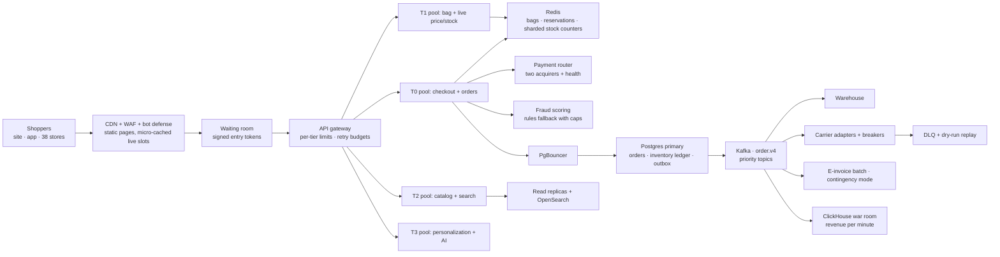
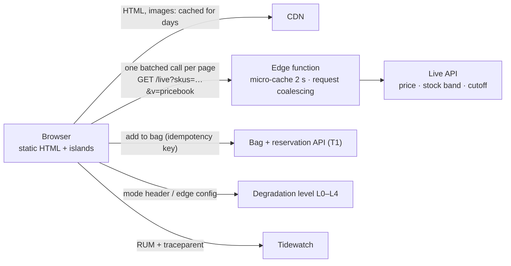

# MARÉ

← [All cases](README.md) · [Atlas](atlas.md) · [Pulse](pulse.md) · [Learning map](learning-map.md)

## System context

Maré is a Brazilian fashion retailer. It sells through a site, an app and 38 stores, and prices everything in BRL (for example `R$1,249.90`). Five internal systems run the business:

- **Counter**: store orders, picking and delivery cutoffs.
- **Product Hub**: catalog, pricing and marketplace sellers.
- **Pay**: the Maré card, installment credit and fraud.
- **Circle**: the creator program and its commission ledger.
- **Mesh**: integrations with carriers, the tax authority's e-invoice service and payment providers.

The consumer storefront is a static-first Astro site with small interactive islands. It has store-level availability, a live delivery cutoff and a bag reserved for 20 minutes.

Maré already has a sound order backbone:

- Checkout writes each order once under an idempotency key.
- A transactional outbox announces the order on one Kafka topic (`order.v4`).
- Warehouse, carrier, invoice and assistant consumers listen, scale on lag and fail alone behind circuit breakers.
- Failures park in a dead-letter queue with a dry-run replay.

That work took API latency 450 → ~200 ms, Error rate 1.8% → 0.5–0.7%, Uptime 99.5 → 99.9% and Recovery time (MTTR) 2–3 h → 30–45 min.

**What the business earns from:** full-price and promotional sales across channels, installment credit and the creator program. Black Friday week is the single largest revenue window of the year: `[value]`% of Q4 revenue in `[value]` hours.

---

## Backend core problem

### Black Friday without losing a sale

> **How can the architecture protect and maximize revenue during Black Friday, while staying reliable and keeping infrastructure cost under control?**

"Handle more traffic" is the wrong framing. On Black Friday, one failed minute at the midnight peak costs more revenue than a quiet Tuesday produces, so every minute is worth a different amount. The real problem has four parts:

1. **The spike is a cliff, not a ramp.** At 00:00, push notifications and emails send the whole audience at once, and the requests-per-second curve becomes a step function. Reactive autoscaling reacts minutes late, and databases don't autoscale at all.
2. **The bottlenecks move.** On a normal day the limit is app CPU. On Black Friday it is the handful of **doorbuster SKUs** (hot rows in inventory), the **orders database write path and its connection pool**, **payment authorization**, and third parties Maré doesn't control: carriers and the tax authority's e-invoice service. The portfolio's own incident P-812 shows the pattern. One config change (`ORDERS_DB_POOL_MAX` 64 → 32) degraded checkout p95 across every channel.
3. **Not all requests are equal.** A failed checkout loses a sale. A missing recommendation row loses almost nothing. The architecture must *know the difference* and protect money first.
4. **Cost is a design input.** Running at peak capacity all year would waste money on 360 days. Running lean would gamble the most valuable 72 hours of the year.

**The metric the whole design serves:** *successful paid orders per minute* (revenue per minute), measured against a forecast band. It is guarded by three SLOs: checkout success rate ≥ `[value]`%, checkout p95 ≤ `[value]` ms, and zero oversold units.

---

## Backend technical system design

### The core idea: revenue-weighted architecture

Every request is classified into a **tier** by what it is worth. Capacity is reserved, and load is shed, in tier order.

| Tier | Requests | Revenue at stake | Under pressure it… |
|---|---|---|---|
| **T0 · money** | payment authorization, order write, reservation confirm | direct | is protected: reserved capacity, its own pools, shed last |
| **T1 · intent** | add to bag, live price and stock, bag view | one step away | is protected, with a cached fallback for stock bands |
| **T2 · browse** | home, category, product pages, search | indirect | is served from the CDN; the origin serves only misses |
| **T3 · delight** | personalized rows, reviews, stories and reels, AI suggestions, new credit applications | small or deferrable | is switched off first and replaced by static equivalents |
| **T4 · internal** | analytics, back-office exports, batch jobs, marketing sync | none today | is paused or queued until the peak passes |

### Architecture



### Request path at 00:00:30

1. **Edge.** Category and product pages are pre-rendered static HTML. Black Friday prices are already inside them (see *price book flip* below), so the CDN answers 95%+ (target) of page requests without touching the origin. The WAF and bot defense rate-limit scalper automation that would otherwise hold doorbuster stock in thousands of bags. The limits are per device and per behavior, not per IP: Brazilian mobile carriers put thousands of real shoppers behind one IP (carrier-grade NAT).
2. **Waiting room (only when needed).** When T0 concurrency crosses a threshold (the *admission limit*, derived from load tests), new checkout sessions get a signed, expiring entry token and a queue position, served first-in, first-out. Shoppers already in checkout are never queued. The bag reservation is **extended** while a shopper waits, so waiting never costs the item.
3. **Gateway.** It applies per-tier concurrency limits (adaptive, raised or lowered from observed latency), load balancing by fewest outstanding requests, and **retry budgets**: retries may add at most 10% (target) extra load, so a slow dependency can't turn into a retry storm.
4. **Bulkheaded pools.** Each tier runs as its own deployment with its own autoscaling, its own DB connection budget and its own timeouts. If personalization melts down, it can't take threads or connections from checkout.
5. **Reservation (T1).** Add to bag reserves stock in Redis with an atomic script, with a 20-minute TTL and an idempotency key from the client. Doorbuster SKUs use **sharded counters** (see below).
6. **Checkout (T0), synchronously: only four things.** Validate the reservation, check the price against the active price book version, authorize payment, write the order and its outbox row in one Postgres transaction. It answers the shopper right after the commit.
7. **Everything else is asynchronous.** Warehouse release, carrier label, e-invoice, Circle commission, loyalty points, emails and analytics all read `order.v4`. On Black Friday they are *allowed to fall behind*: consumers autoscale on lag, and a spike becomes a backlog instead of timeouts.

### Components

| Component | Problem it solves | Why chosen | Alternative | Trade-off | Metric it moves |
|---|---|---|---|---|---|
| **CDN with static pages + surrogate-key purge** | Browse traffic would need a fleet of origin servers at peak | Astro already emits static HTML; the CDN scales per point of presence for free | Server-render every page on demand | Staleness must be managed by versioned content and purge keys | Origin cost per order; page speed → conversion |
| **Price book flip** | Purging millions of pages at 00:00 would stampede the origin | Prices are a versioned *price book*. Black Friday pages are pre-rendered with the BF book, and an edge config switch activates it at 00:00. Live slots confirm the price. | Mass purge at midnight | Two versions must be built and verified ahead of time | Zero wrong-price orders; no midnight stampede |
| **Bot defense + device-based limits** | Scalper bots hoard doorbusters in bags, so real shoppers see "sold out" | Protects both inventory and capacity | Limits per IP | Some false positives need a challenge; carrier-grade NAT rules out per-IP limits | Real-shopper conversion on doorbusters |
| **Waiting room with signed tokens** | Beyond the admission limit, more concurrency makes *everyone* slower (latency collapse) | Keeps the core inside its tested envelope; fair and honest | Unlimited autoscaling; random 503s | Some shoppers wait. The design bet is that a short, honest wait converts far better than an error page | Checkout success rate; conversion at peak |
| **Per-tier pools (bulkheads)** | One slow feature starving checkout of threads or connections | Isolation that is simple to operate at Maré's size | Cell-based architecture per customer shard | Fewer shared resources means more idle capacity | Checkout availability during partial failures |
| **Redis: bags, reservations, sharded counters** | Hot-row lock contention on doorbuster inventory | Atomic in-memory operations take microseconds; TTL gives reservations for free | `SELECT … FOR UPDATE` on one inventory row | Redis is the fast path and Postgres the ledger, which requires reconciliation | Oversell = 0; add-to-bag latency |
| **Postgres + PgBouncer** | Autoscaled pods opening thousands of connections (the P-812 lesson) | Orders need ACID transactions. Transaction-mode pooling caps connections regardless of pod count | Managed NoSQL for orders | Postgres is scaled up, not out; the primary must be sized before the event | Checkout p95; zero lost orders |
| **Orders partitioning + read replicas** | Vacuum, index bloat and reads competing with writes on the primary | Keeps the write path lean; reads go to replicas | Sharding orders across several primaries | Replica lag means order-status pages read "slightly old" data | Checkout write headroom |
| **OpenSearch, pre-warmed** | Search latency spikes on cold caches | Existing search; warm the top queries from last year's logs | Search served by Postgres | Warm-up job to maintain | Search → product page conversion |
| **Payment router across two acquirers** | One acquirer's brownout = all card revenue stops | Health-based routing (approval rate, latency) with failover | A single payment provider | Two contracts to run, and reconciliation across both | Payment approval rate, the largest revenue lever at checkout |
| **Fraud scoring with a capped rules fallback** | The scoring model slows down under load; failing closed blocks legitimate buyers | If the score is late, fall back to rules with lower order-value caps | Fail closed; fail open without caps | Accepts a bounded fraud increase `[value]` to avoid rejecting good orders | Approval rate vs chargeback rate |
| **Kafka with priority topics** | Downstream work competing with payment confirmations | Existing backbone; separate topics so `payment.confirmed` isn't queued behind marketing events | One topic for everything; synchronous orchestration | More topics and consumer groups to operate | Order-to-ship time; checkout latency unaffected by downstream |
| **E-invoice batch with contingency mode** | The tax authority's service slows down or fails on peak days | Idempotent by invoice number; the authority's timeouts become retries, not duplicates | Issue invoices synchronously at checkout | Shipping waits for invoices, so fulfillment runs later | Orders shipped on time; zero duplicate invoices |
| **ClickHouse war room** | Leaders need revenue per minute, payment approval by acquirer and conversion, *now* | A columnar store reads the event stream in seconds | Dashboards on the orders primary | One more store to run | Decision speed during the event |
| **OpenTelemetry → Tidewatch + synthetic checkouts** | Knowing *before customers* that checkout is failing | Traces link a slow page to the slow span; a synthetic order every minute proves the path works | Logs only | Telemetry volume and cost (sample browse traffic, keep all T0 traces) | MTTR; minutes of lost revenue |
| **Feature flags / edge config** | Turning features off in seconds without a deploy | Required by the degradation ladder | Emergency deploys | Flags must be tested in both states before the event | Time to degrade |
| **Demand forecast (ML)** | Knowing *which* SKUs and *what* peak to prepare for | Last year's curves + campaign plan + stock → per-SKU and per-hour forecast | Last year × a growth factor | Forecast error, so capacity is planned with headroom | Cost of over-provisioning vs the risk of under-provisioning |

### Deep dive 1 · Hot inventory: sharded counters with a ledger

A doorbuster like the linen midi dress at 60% off gets thousands of add-to-bag requests in the first seconds. With one inventory row, every request waits for the same row lock, so throughput collapses to about one reservation per lock duration.

```text
stock 1,000 units → 10 shards of 100 units each (Redis keys sku:510233:s0 … s9)
reserve(sku, qty, idem_key):
  pick a shard (hash of session, then probe neighbors if empty)
  atomic script: if shard >= qty then decrement, write reservation{idem_key, ttl 20 min}
  emit reservation.created → Kafka → Postgres ledger (async, idempotent)
expire / cancel → increment the same shard → reservation.released
rebalancer: every few seconds, move units from full shards to empty ones
reconciler: Postgres ledger is the truth; Redis is repaired from it on any mismatch
```

- **Why not oversell and cancel?** Cancellations after payment mean refunds, angry customers, consumer-protection complaints and support cost. The damage lasts longer than the sale.
- **The accepted cost** is a brief *undersell*: one shard shows empty while another still has units, until the rebalancer runs. The last few units sell seconds later instead of never being oversold.
- **Store stock** (ship-from-store across 38 stores) is less accurate than warehouse stock. On Black Friday, ship-from-store keeps a safety buffer per store, or turns off for stores with low count accuracy.

### Deep dive 2 · Capacity planning with Little's law

Concurrency = throughput × latency. For each tier, estimate peak arrivals and design so the system stays in its linear zone.

*Illustrative inputs, not measurements:*

```text
forecast peak checkouts        = 60 orders/s  (00:00–00:15, after push notifications)
checkout service time (p95)    = 0.8 s        → in-flight checkouts ≈ 60 × 0.8 = 48
DB time per checkout           = 25 ms        → DB-busy connections ≈ 60 × 0.025 = 1.5 avg, size the pool for bursts: 32–64
payment authorization (p95)    = 1.5 s        → concurrent auths ≈ 90, below each acquirer's contracted limit?
headroom target                = load-test to 2× forecast, admission limit at 1.3× forecast
```

What falls out of this arithmetic:

- The **database** isn't the first limit if checkout holds a connection only during the transaction. That is why PgBouncer in transaction mode matters.
- **Payment authorization** latency dominates, so the payment router's timeouts and failover decide the peak.
- The **self-inflicted spike** is the largest. Staggering push notifications by cohort over 10 minutes (a marketing decision) flattens the peak more cheaply than any server.

### Deep dive 3 · The degradation ladder

The ladder is decided in October, rehearsed in a game day, and executed in November by automation, with a person able to override it. Each level is a set of feature flags. Levels step up from SLO burn-rate signals and step down only by hand.

| Level | Trigger (illustrative) | What turns off or changes | What the shopper notices |
|---|---|---|---|
| **L0 · normal** | — | nothing | nothing |
| **L1 · lean** | T0 p95 above target for 2 min, or the T3 pool saturated | personalized rows → the static bestseller row already in the HTML; reviews served from cache; stories and reels stop autoplaying | slightly less personal pages |
| **L2 · focused** | checkout error budget burning 14.4× (the fast-burn alert) | search facets cached, expensive sorts off, new credit applications paused (existing Maré cards still work), back-office exports paused | fewer filters |
| **L3 · queue** | T0 concurrency at the admission limit | waiting room engages for *new* checkouts; bag reservations extended while waiting | an honest queue with an estimated wait time |
| **L4 · checkout-only** | primary database or payment in partial failure | browse served stale from the CDN; every write except orders is queued | "we're busy — your bag is safe" |

### Payments: where Black Friday revenue is won or lost

- **Two acquirers** with routing by payment method and card BIN, a health score (approval rate and latency over a 1-minute window) and automatic failover. A drop in approval rate that is *not* explained by the fraud model points at the acquirer, so traffic shifts away from it.
- **Instant bank transfers (Pix)** are asynchronous: the shopper scans a code and a webhook confirms payment. Webhooks go into a queue with idempotent processing. The reservation holds until confirmation or expiry.
- **Installments on the Maré card** go through Pay's credit scoring. New *credit applications* are T3 and pause at L2. *Purchases* on existing cards are T0.

### Multi-region: deliberately not active-active

Maré sells in one country. The design uses **one region with three availability zones**, plus a static storefront that any CDN point of presence can serve if the region fails. Checkout has a documented recovery target (RTO `[value]` min, RPO ≈ 0 through synchronous replication across zones). Warm-standby failover to a second region is rehearsed once before the event.

Active-active checkout across regions was rejected. Inventory would then need cross-region consensus or accepted oversell, which costs more and risks more than the outage it prevents.

### Reliability practice

- **Change freeze** from `[date]`, except flagged kill switches.
- **Load test** on production-shaped data at 2× forecast (target) two weeks out. **Game day** one week out, using the chaos actions the portfolio already models: saturate the orders DB pool, break a carrier, fail e-invoices, spike traffic 3.4×.
- **Pre-warm** everything: scheduled scale-up at 22:00 (warm pools, caches and search), not reactive autoscaling at 00:00.
- A **war room** with one dashboard showing revenue per minute vs forecast band, approval rate by acquirer, degradation level and the error budget.

### Cost model

The investment question is expected loss, not peak capacity:

```text
expected lost revenue = Σ over failure scenarios  P(scenario) × minutes down × revenue/min at that hour × (1 − share recovered later)
readiness spend       = extra compute for the 72 h window + second acquirer + load tests + waiting room + engineering time
decide: spend while each unit of readiness removes more expected loss than it costs
```

Cost levers that don't touch revenue:

- Serve more from the CDN: every point of offload removes origin servers.
- Run asynchronous workers on spot/preemptible capacity, since they can lag.
- Size baseline capacity for normal days and burst for the peak window only.
- Track *cost per successful order* as the efficiency metric.

### Where AI earns a place (and where it doesn't)

- **Demand forecasting** (per SKU, per hour) decides which counters to shard, which pages and queries to pre-warm, and how much capacity to schedule.
- **The ops assistant** (already in Maré) watches the event stream and proposes a ladder step or an acquirer shift with evidence. A person approves. L1 is the only automatic step.
- **The fraud model** is a model, so it gets a capped fallback.
- **Not used:** an LLM in the checkout path. It adds latency and variance to the one path that must be boring.

---

## Backend trade-offs

| Decision | Chosen | Alternative | Why this way | What we accept |
|---|---|---|---|---|
| How to absorb the spike | Scheduled pre-scaling from the forecast, plus reactive autoscaling on top | Reactive autoscaling only | Autoscaling reacts in minutes; the spike arrives in seconds, and databases don't autoscale | Paying for idle capacity from 22:00 until the peak |
| Overload behavior | Admission control (waiting room) at a tested limit | Let everything in and scale | Past saturation, latency grows without bound and *every* checkout slows down | Some shoppers wait in a queue |
| Hot inventory | Sharded Redis counters + Postgres ledger | Row locks; optimistic retries; oversell-and-cancel | Row locks serialize; optimistic retries storm; cancellations destroy trust | Reconciliation code, and brief undersell of the last units |
| Checkout scope | Four synchronous steps; everything else asynchronous | Synchronous orchestration of invoice, label and commission | Each synchronous dependency multiplies failure probability | Eventual consistency: "order confirmed" before "label created" |
| Payments | Two acquirers with health routing | One provider | A payment brownout is the most expensive failure on the day | Double integration, reconciliation, contract minimums |
| Fraud under load | Fall back to rules with caps | Fail closed / fail open | Balances lost sales against fraud with an explicit ceiling | Bounded extra fraud risk `[value]` |
| Geography | Multi-AZ in one region + static failover | Multi-region active-active | One country; active-active inventory costs more than it saves | A regional disaster means a checkout outage within the stated RTO |
| Degradation | Pre-agreed ladder, automatic L1, human-approved beyond | Improvise on the night | Decisions under stress are worse; flags must be tested in advance | Features the business likes are off at peak |

---

## Backend business decision

**Decision.** Invest in Black Friday readiness, sized by expected lost revenue. That means pre-scaled capacity, a waiting room, a second payment acquirer and a rehearsed degradation plan that sacrifices non-revenue features first. The alternative is optimizing infrastructure for average-day cost.

1. **What are we deciding?** Whether to spend on peak readiness and agree, in advance, which features turn off when the platform is under pressure.
2. **Why now?** Black Friday concentrates `[value]`% of Q4 revenue in a few hours. Revenue at 00:05 is worth many ordinary minutes, and the failure modes (hot stock, payment brownouts, connection storms) only appear at that scale.
3. **Which metrics change?** Successful orders per minute at peak, checkout success rate, payment approval rate and oversold units (target 0). Infrastructure cost per successful order also improves, because more of the traffic is served by the cheap layer (the CDN).
4. **What do we sacrifice?** A higher infrastructure bill for about one week. Personalization and some filters at peak. Some shoppers wait in a queue. A bounded fraud risk if scoring slows down. And weeks of engineering time before the event instead of new features.
5. **What if we get it wrong?**
   - *Too little:* the site fails at the most valuable minute of the year. Lost revenue can't be recovered, customers remember it, and support queues run for weeks.
   - *Too much:* money spent on capacity that sits idle.
   - The expected-loss model is how to get it right: spend while each unit of readiness removes more expected loss than it costs.

---

## Frontend core problem

### Live truth on a static storefront

The current storefront is right, and it stays:

- static HTML from Astro, small islands, the Maré visual language and a 60 kB gzipped JS budget;
- zero layout shift, keyboard-complete overlays, the delivery cutoff on a shared clock and the 20-minute bag.

The problem is what that architecture doesn't yet handle. **On Black Friday the few parts of a page that change every second decide whether a sale happens.** Those parts are price, stock, the bag reservation and backend health.

- A static page that shows *In stock* for a sold-out doorbuster sells nothing, and the shopper finds out at payment. That is the most expensive moment to disappoint someone.
- Rendering every page on the server to keep it fresh would put Black Friday traffic on the origin, which is exactly what the backend design avoids.
- When the backend degrades (ladder levels L1–L4), a naive frontend shows spinners, broken rows and error pages. A good one quietly becomes simpler and keeps the buy button working.

> **How do we keep pages CDN-fast while never showing a price or availability that checkout will reject, and keep the purchase path working as the backend degrades?**

**Metrics:** add-to-bag → paid conversion, the rate of "no longer available" at checkout, INP and LCP at peak (field data), CDN offload ratio (cost), and the share of sessions that reach checkout while the ladder is at L1–L4.

---

## Frontend technical system design

### Principle: a static shell, a few live slots

Every page is split in two:

- **The static shell** (about 95% of the bytes): layout, images, copy, product facts and the price from the active price book. It is built ahead of time, cached for days and purged by surrogate key.
- **Live slots** (the other 5%): the live price confirmation, stock band, delivery promise, bag count and reservation timer, and the degradation level. Each slot reserves its space in the HTML, so filling it never moves the layout.



### 1 · One batched live call, micro-cached at the edge

- **One call per page.** Each page makes one request for all SKUs visible above the fold (PDP: 1 SKU; category: first 24), then more as the shopper scrolls. It's never one request per product card.
- **Micro-cache.** The edge caches `/live` responses for about 2 seconds (illustrative), and **coalesces** identical in-flight requests. If 100,000 shoppers watch the same doorbuster, each point of presence sends roughly one request to the origin every 2 seconds, not 100,000.
- **Stock as bands, not counts:** *In stock*, *Few left*, *Last units*, *Sold out*. Bands change rarely, so they cache well and stay honest. The exact truth arrives at the one moment it matters: the reservation. A precise "3 left" that is wrong half the time is worse than a band that is always right.
- **Price confirmation.** The HTML carries `pricebook=v`. If the live slot returns a different version (the 00:00 flip, a flash price), the price updates in place with a short highlight. Its box is already reserved, so CLS stays 0.

### 2 · Add to bag: optimistic when it is safe, confirmed when it's not

| Stock band | UI behavior | Why |
|---|---|---|
| In stock | **Optimistic**: the bag count updates instantly and the reservation confirms in the background; the rare failure rolls back with an explanation | Near-certain success; instant feedback lifts conversion |
| Few left / Last units | **Confirmed**: the button shows *Reserving…* (≤ 300 ms target), then *Reserved for 20 min* | A false "added" on a scarce item is the worst experience in retail |
| Sold out | Button becomes **Notify me** + "similar in your size" from the static bestseller data | Keeps the visit useful without a live call |

- **Idempotency keys** are generated per click, in the browser. A retry after a timeout can never reserve twice.
- **The reservation timer** in the bag counts down on the shared world clock. It pauses visibly while the shopper is in the waiting room, because the backend extends the reservation.
- The bag has a **local mirror** in `localStorage`: the bag drawer opens instantly from the mirror and reconciles with the server. The server is always the truth, and differences are shown ("1 item sold out while you were away").

### 3 · Brownout-aware UI

The degradation level reaches the client in two ways: a response header on every live call, and a tiny edge-config document. Components declare their tier. A small **capability registry** decides what renders:

```ts
// Each island declares its tier; the registry decides what renders at each level.
register('personal-row', { tier: 'T3', fallback: 'static-bestsellers' });
register('reviews',      { tier: 'T3', fallback: 'cached-summary' });
register('reels',        { tier: 'T3', fallback: 'poster-only' });
register('search-facets',{ tier: 'T2', fallback: 'cached-top-facets' });
register('add-to-bag',   { tier: 'T1' });   // never disabled below L4
register('checkout',     { tier: 'T0' });   // never disabled
```

- **Fallbacks are already in the HTML.** The static bestseller row, cached review summary and poster frames are rendered at build time and hidden. Degrading shows them. It never fetches anything new at the worst possible moment.
- **Waiting room UX.** A full-screen, calm page with a position and an honest estimated wait, the bag visible with its reservation paused, no auto-refresh storm (the client polls with jitter, and the server says when to come back), and one tap to return.
- **No dead ends.** Every error state has a next action: retry, choose another size, *Notify me*, or pay with another method.

### 4 · The purchase path gets its own budget

- **Checkout is its own island bundle**, with **no third-party tags** (tag managers and pixels are the most common cause of peak-day INP regressions). Marketing measurement uses server-side events instead.
- **Speculative prefetch**: when the bag drawer opens, prefetch the checkout document and the payment provider's field script, so the checkout page appears instantly.
- **Payment failure recovery**: if an acquirer declines for a technical reason, the UI offers the next method (another card, or instant transfer with a QR code) without losing the form. Instant transfers show the QR code and wait for confirmation over server-sent events, with polling as a fallback.
- **Pix/QR confirmation** and the order confirmation page are built to survive reloads: the order ID in the URL is enough to restore the page.

### 5 · Resilience and performance on real Brazilian networks

- Timeouts on every live call (the page stays useful without it: bands fall back to "check availability in bag"), retries only for idempotent calls, with jittered backoff.
- A **service worker** caches the shell's CSS, fonts and core JS for repeat visits during the week. It never caches live slots or checkout.
- **Budgets:** the existing 60 kB gzipped JS budget for the shop, plus a *Black Friday tag budget* agreed with marketing, enforced in CI.
- **Field measurement**: real-user monitoring reports LCP, INP and CLS, tagged with page type, degradation level and device class, and joined to conversion. That way "slow" is measured in reais, not milliseconds.

### 6 · Observability across the boundary

- Every live, bag and checkout request carries a W3C `traceparent`, so Tidewatch shows *this shopper's slow add-to-bag* next to *the Redis span that was slow*.
- The client reports **business events** (reserve attempted, reserved, rolled back, entered waiting room, left waiting room, checkout started, paid) with the degradation level. The war room sees the funnel per level live.

### Components

| Component | Problem it solves | Why chosen | Alternative | Trade-off | Metric it moves |
|---|---|---|---|---|---|
| **Static shell (kept)** | Browse at Black Friday scale without origin load | Already strong: fast, cheap, accessible | Server-render every page | Freshness handled by live slots and purge keys | LCP; cost per session |
| **Batched `/live` + edge micro-cache** | Fresh price and stock without origin stampedes | One small request per page; coalescing turns N viewers into ~1 origin call | WebSockets push per product; client polling per card | Up to ~2 s staleness on bands | "No longer available" rate; origin cost |
| **Stock bands** | Precise counts are expensive and often wrong at peak | Honest and cacheable | Exact counts ("3 left") | Less precise urgency messaging | Checkout rejections; trust |
| **Confidence-based optimism** | Instant feedback without false promises | Optimistic where success is near-certain, confirmed where it isn't | Always optimistic; always pessimistic | Two code paths | Add-to-bag → checkout rate |
| **Capability registry + build-time fallbacks** | Degrading without spinners or new requests | Degraded states exist in the HTML already | Hide components with CSS only; error boundaries only | Every T2/T3 island must ship a fallback | Conversion at L1–L4 |
| **Isolated checkout bundle, no third-party tags** | Peak-day INP regressions from marketing scripts | The purchase path is the one that must never regress | Tags everywhere via a tag manager | Marketing measures via server events instead | INP on checkout; payment completion |
| **RUM joined to conversion** | Knowing which slowness costs money | Performance work gets a revenue number | Lab-only tests | Data volume, privacy review | Prioritization quality |

---

## Frontend trade-offs

| Decision | Chosen | Alternative | Why this way | What we accept |
|---|---|---|---|---|
| Rendering | Keep static-first with islands; add live slots | Move to full server rendering | The static shell is what makes peak traffic cheap and fast | Two layers to keep consistent (build-time and live) |
| Live transport | Batched HTTP + micro-cache + coalescing | WebSockets or server-sent events per product | Millions of persistent connections cost more than they're worth for data that changes every few seconds | ~2 s staleness (target) on bands |
| Stock display | Bands | Exact counts | Always true, cacheable, and still creates urgency | Less precise scarcity messaging |
| Add to bag | Optimistic for plentiful stock, confirmed for scarce | One policy for all | The cost of a false positive rises with scarcity | More states to design and test |
| Degradation | Build-time fallbacks switched by level | Fetch fallbacks on demand; show errors | Nothing new is requested at the worst moment | Every T2/T3 island needs a fallback and tests at each level |
| Third parties | None on checkout; a tag budget elsewhere | Marketing's usual tag set | INP and reliability on the money path | Less client-side attribution; server-side events instead |

---

## Frontend business decision

**Decision.** Keep the storefront static-first. Make only price, stock, the bag and backend health live. Show stock as honest bands, and let the interface simplify itself on a pre-agreed plan instead of breaking under load.

1. **What are we deciding?** Not to rebuild the storefront for Black Friday, but to add a thin live layer and a degraded mode to the one that works.
2. **Why do we need to?** The most expensive disappointment in retail is finding out at payment that an item is gone or the price was wrong. The second most expensive is a page that breaks when the backend is busy. Both peak on Black Friday.
3. **Which metrics change?** Add-to-bag → paid conversion at peak `[value]`, the rate of "no longer available" at checkout `[value]`, checkout INP, and infrastructure cost per session (more traffic stays on the CDN).
4. **What do we sacrifice?** Exact stock counts become bands. Some personalization and extras disappear at peak by design. Marketing gives up client-side tags on checkout. And the team spends time on fallbacks that, on a good day, nobody sees.
5. **What if we get it wrong?**
   - *Fully static:* we sell sold-out items, cancel orders and pay for it in support cost and reputation.
   - *Server-render everything:* the origin carries all the traffic, cost rises, and the site is slowest exactly when it matters.
   - *No degraded mode:* a backend brownout becomes a frontend outage, even while checkout itself is healthy.

---

## Decision chains

| Problem | Architectural decision | Trade-off | Engineering concept | Practical implementation | Business metric |
|---|---|---|---|---|---|
| Midnight spike arrives faster than autoscaling | Scheduled pre-scaling + staggered push notifications | Idle cost before the peak | Capacity planning, Little's law | Forecast → scale schedule at 22:00; notifications in cohorts over 10 min | Revenue per minute at 00:00–00:15 |
| Past saturation everyone gets slower | Admission control at a tested limit | Some shoppers wait | Queueing theory, load shedding | Signed-token waiting room keyed to T0 concurrency | Checkout success rate |
| Doorbuster hot rows | Sharded counters + ledger | Brief undersell; reconciliation | Contention, sharding, eventual consistency | Redis atomic script per shard, Kafka → Postgres ledger, rebalancer | Oversold units = 0; conversion on doorbusters |
| Retries amplify failures | Retry budgets + idempotency keys | Some requests fail instead of retrying | Retry storms, idempotency | Gateway retry budget 10%; client keys per click | Error rate at peak |
| One failure spreads | Per-tier bulkheads | More idle capacity | Failure isolation | Separate pools, connection budgets, timeouts per tier | Checkout availability |
| Payment brownout | Two acquirers with health routing | Integration and reconciliation cost | Redundancy, circuit breaking | Router with 1-minute health windows | Payment approval rate |
| Features compete with checkout | Degradation ladder | Features off at peak | Graceful degradation, brownouts | Flags per tier, burn-rate triggers, build-time fallbacks | Conversion under stress |
| Fresh data on a static page | Batched live slots, micro-cache, coalescing | ~2 s staleness | Cache hierarchies, request collapsing | `/live?skus=…` at the edge, 2 s TTL | "No longer available" rate; origin cost |
| False "added to bag" | Confidence-based optimism | Two code paths | Optimistic UI, reconciliation | Policy per stock band; idempotent reserve | Add-to-bag → paid |

---

## Key engineering concepts to learn

1. **Little's law and capacity planning.** Concurrency = throughput × latency. It tells you where the first wall is before a load test finds it.
2. **Queueing, saturation and admission control.** Why latency explodes near 100% utilization, and why a waiting room beats "scale forever".
3. **Contention and hot keys.** Locks, sharded counters and why the hardest scaling problem is often *one* row.
4. **Idempotency and at-least-once delivery.** How "safe to retry" makes every other resilience technique possible.
5. **Transactional outbox and event-driven backpressure.** A spike becomes a queue; consumers catch up; checkout never waits.
6. **Bulkheads, circuit breakers and retry budgets.** Stopping one failure from becoming all failures.
7. **Graceful degradation (brownouts).** Deciding in advance what to switch off, and building the degraded state as a first-class screen.
8. **Cache hierarchies.** Static at the CDN, micro-cache at the edge, coalescing at the origin, and when staleness is a feature.
9. **SLOs as business metrics.** Revenue per minute, burn-rate alerts and error budgets as the language between engineering and the business.
10. **Cost as a design input.** Expected-loss arithmetic, and paying for peak only when the peak happens.

---

All names are fictitious · data is synthetic · AI behavior is simulated in v0.2
