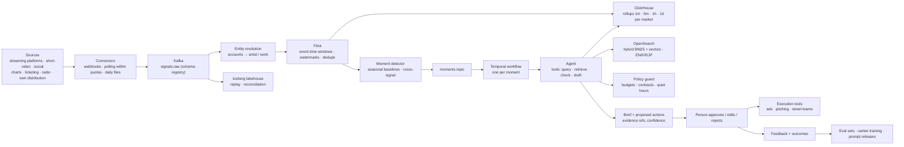
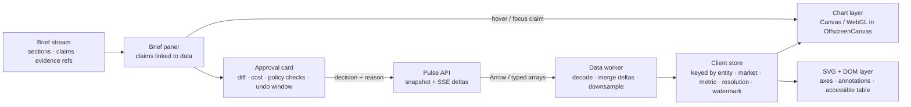

# PULSE

← [All cases](README.md) · [Maré](mare.md) · [Atlas](atlas.md) · [Learning map](learning-map.md)

## System context

Pulse is an entertainment company with teams in LA, Seoul and Tokyo. It manages a roster of artists (Hana Rae among them), releases music through its own distribution engine and runs campaigns across three markets. Its product surfaces:

- **Intelligence**: performance intelligence per artist and market.
- **Audio intelligence**: per-track analysis.
- **Distribution and campaigns**: release plans and campaign recaps (Campaign Wrapped).
- **Street teams**: fan teams dispatched for local promotion.
- **Wallet**: talent payouts.
- **AI harness**: RAG with citations, a judge, an evaluation gate and fine-tuned vs base model comparisons.

Two problems shaped the first version. Teams saw the same artist as seven accounts written in three scripts, and analysts couldn't see which sources shaped an AI answer. The measured results: Analytics queries 5–10× faster and Availability 99.8%.

**What the business earns from:** streaming and sales royalties, touring and ticketing, brand partnerships and merchandise. Campaign money (ads, playlist pitching, street teams, content) is the largest discretionary spend.

**The core commercial fact:** a breakout moment (a clip spreading in Seoul at 23:00, a sync placement in LA, a chart jump in Tokyo) is worth the most in its first hours. Acting on it the next morning, after a meeting, is often too late.

---

## Backend core problem

### From moment to action

> **How do we detect a breakout moment in a live stream of signals from three markets, and turn it into a ranked, evidence-backed action (with an agent that proposes and a person who approves) fast enough to matter, while learning from what happened afterwards?**

Why this is the most valuable backend problem for Pulse in 2026 Q4:

1. **Time-to-action is money.** Moving campaign budget toward a breaking moment within hours instead of days changes what that money buys. Target: time from moment start to approved action ≤ `[value]` min.
2. **The data is messy in the ways that matter.**
   - Platforms report late and revise their numbers.
   - One artist is many accounts across scripts.
   - Each market's "day" starts at a different time.
   - A broken connector can look exactly like a collapse in streams.
3. **Alerts alone fail.** Dashboards and threshold alerts already exist in most companies. People stop reading them (alert fatigue), and an alert without context still needs an analyst to spend an hour before anyone can decide.
4. **AI has to act, safely.** The 2026 opportunity is an **agent that does the analyst's first hour**: gathering evidence, checking constraints (budgets, contracts, quiet hours), drafting an action. The risk is an agent that spends money on a false signal. The architecture must make the agent *useful, bounded and measurable*.
5. **It has to improve.** Every approved, edited or rejected proposal and every outcome is data. Without a feedback loop the system never gets better than day one.

**The metrics:**

- **Time-to-action** on real moments.
- **Precision of moments.** The share of surfaced moments a person agreed were real.
- **Proposal acceptance rate and edit distance.**
- **Campaign ROI:** incremental streams or sales per unit of spend, measured against holdouts.
- **Analyst hours per moment.**
- **Cost per brief.**

---

## Backend technical system design

### Architecture

### 1 · Ingestion that respects quotas and reality

- **Connectors per source**, each with its own mode: webhooks where offered, polling where not, daily files for official reports.
- **Polling is scheduled against quota budgets.** Each API key gets a token bucket, and hot entities (artists in a live moment) get polled more often, within the same quota. The quota is a scarce resource allocated by value, not first come, first served.
- Every signal is normalized into one contract, `Signal{source, account, market, metric, value, event_time, observed_at, revision}`. It is validated against a **schema registry** and written to Kafka, partitioned by account.
- Raw payloads also land in the **lakehouse** for replay. When a parser bug is found, the fix is a replay, not a refetch that the source's quota may not allow.

### 2 · Entity resolution in the stream

- A resolution service maps platform accounts and tracks to canonical **artist** and **work** IDs. It uses three layers:
  - *rules*: verified links, identifiers such as ISRC for recordings;
  - *multilingual name embeddings* with transliteration across Hangul, Kana/Kanji and Latin;
  - a *human confirmation queue* for uncertain matches.
- The stream is enriched with canonical IDs. When a later merge happens ("these two accounts are the same artist"), a **correction event** triggers a backfill of affected rollups from the lakehouse. History becomes right without a manual fix.

### 3 · Stream processing on event time

- **Flink** computes windowed aggregates per artist × market × platform × metric on **event time**, not arrival time:
  - platforms deliver late, so **watermarks** decide when a window is complete enough to use;
  - late events update the window as a revision;
  - duplicates from retries and overlapping polls are removed by `(source, account, metric, event_time)`.
- **Market-local days.** Events are stored in UTC, and daily rollups are computed per market time zone. "Yesterday in Seoul" and "yesterday in LA" are different windows.
- **Two truths, both labeled.** The stream produces **provisional** numbers within minutes. The daily batch reconciles against official platform reports and produces **reconciled** numbers. Both are stored and the UI shows which is which. This is a kappa-style design: one streaming pipeline, plus replay from Kafka and the lakehouse for recomputation, instead of maintaining separate batch and stream code paths.
- **ClickHouse** stores rollups at four resolutions (1 min, 5 min, 1 h, 1 day) as materialized views. Dashboards and the agent read a resolution that fits the question, which keeps queries in the fast range already measured (Analytics queries 5–10× faster).

### 4 · Moment detection: statistics first, learning later

- **Baselines are seasonal per entity and market.** Streams at 23:00 in Seoul are compared with Seoul's normal 23:00 for that artist, not with LA's afternoon. Robust statistics (median and MAD, seasonal decomposition) keep one viral day from poisoning the baseline.
- **Signals are combined across sources.** A short-video surge that precedes a streaming lift in the same market is a stronger moment than either alone. Lead-lag patterns are scored explicitly.
- **Data-quality guard.** Before any moment is emitted, the detector checks connector health. A 90% drop in a source's volume is flagged as a **pipeline incident**, not a moment. This single rule prevents the most embarrassing class of AI proposals.
- **Ranking.** Candidate moments are ranked by magnitude × confidence × commercial relevance: the artist's release calendar, active campaigns, tour dates. At first the ranker is rules. Once enough labeled outcomes exist, a learned ranker trained on feedback replaces it behind the same interface.

### 5 · The agent: a durable workflow with bounded tools

Each moment starts a **Temporal workflow**, a durable execution that survives crashes, retries steps and records every step. Inside it, an agent runs with a fixed toolset:

| Tool | Kind | Guardrail |
|---|---|---|
| `query_metrics(entity, market, metric, window, resolution)` | read | parameterized (no free SQL), row limits, read-only replica |
| `retrieve(query, filters)` | read | hybrid search over playbooks, past campaigns, prior moment outcomes, contracts, market calendars; returns chunk ids |
| `check_policy(action)` | read | budget caps per artist and market, contract clauses (brand exclusivity, territory), quiet hours, approval level |
| `estimate(action)` | read | cost and an expected-impact *range* from past comparable actions, with its sample size; `[value]` when there isn't enough history |
| `draft_brief(...)` | write (draft only) | structured output (JSON schema), must cite evidence ids |
| `execute(action)` | **write, gated** | only after a person approves; idempotency key per action; undo window where the channel supports it |

- **Numbers first.** Every number in the brief must come from a tool result. A validator matches each figure against the workflow's tool outputs before the brief is shown. The model writes the hypothesis and the reasoning, never the numbers.
- **Model routing.** A small fast model classifies the moment type and extracts entities. A frontier model writes the brief. The workflow has a **cost budget per moment**, and past it the brief degrades to a numbers-only template.
- **Provider failure** means the same degraded template (charts, facts, policy checks, no prose). A moment is never lost because a model API is down.
- **Approval levels.** Low-spend, reversible actions (pitching a playlist, briefing a street team) need one approver. Budget shifts above a threshold need two. No action executes without a person.

### 6 · Retrieval (RAG) over the company's own memory

- **Corpus:** campaign reports, playbooks, prior moment briefs *with their outcomes*, contract summaries, market calendars (holidays, award shows, TV schedules), audio intelligence notes.
- **OpenSearch** holds both BM25 and vector indexes. Hybrid retrieval matters here: artist and song names are exact tokens that dense vectors blur, while themes ("a fan-made dance trend") are semantic. OpenSearch also ships Korean (nori) and Japanese (kuromoji) analyzers, which a vector-only store lacks.
- **Chunking** follows document structure (a campaign report's "what worked" section is one chunk). Metadata filters narrow by artist, market and date before ranking, and a cross-encoder **reranker** orders the top 50.
- **Freshness.** Documents are re-indexed from change events, so a campaign report written this morning is retrievable this afternoon.
- **Citations are mandatory.** A claim without a retrieved chunk or a tool result is removed by the validator.

### 7 · Evaluation and release gates (the existing AI harness, extended)

- **Offline evaluation set:** past moments with the brief an expert wrote, the action taken and the outcome. Every prompt or model change runs it and is scored on factual consistency (automatic), citation coverage (automatic) and usefulness (a judge calibrated against human ratings).
- **Canary routing:** a new model or prompt serves a small share of moments first. Online metrics (acceptance rate, edit distance, time-to-approve) are compared before full rollout. This is the existing "canary routing for models", now gated by business metrics.
- **Every workflow step is traced** with OpenTelemetry-style spans: tokens, cost, latency, tool calls and validator results. A bad brief can be traced to the step that produced it.

### 8 · Learning from outcomes, honestly

- **Feedback:** approve, edit (the diff is stored) or reject, with a reason code (*not a real moment*, *wrong action*, *bad timing*, *policy*). These become labels for the moment ranker and examples for prompts.
- **Outcomes:** did streams, sales or followers lift after the action? Measured against a **counterfactual**: the artist's own seasonal forecast, comparable artists that weren't acted on, and small **holdouts** (a share of low-stakes moments deliberately not acted on). Without holdouts, the system learns that "acting always works", because moments tend to grow anyway.
- Later, action ranking can become a **contextual bandit**: mostly the best-known action, sometimes an alternative, which is how the system discovers better actions without risky experiments.

### 9 · Serving three markets

- **Data isn't heavily regulated here** (aggregate platform metrics, not personal data), so one primary processing region is enough. Read replicas of the rollups and API edges sit near LA, Seoul and Tokyo for dashboard latency.
- **Live updates** go out as server-sent events per workspace, with sequence numbers.
- The **approval inbox** follows the sun: moments route to the team whose market and working hours match. Quiet hours are enforced by the policy tool, so no 3 a.m. pings unless severity requires it.

### Components

| Component | Problem it solves | Why chosen | Alternative | Trade-off | Metric it moves |
|---|---|---|---|---|---|
| **Quota-aware connectors** | API quotas are scarce; hot entities need fresher data | Spend quota where value is | Fixed polling intervals for everything | Scheduler complexity | Time-to-detect |
| **Kafka + schema registry** | Many producers, many consumers, replay | Durable, partitioned, replayable log; contracts enforced | Managed queue; direct writes to the database | Cluster operations | Reliability; recovery after bugs |
| **Entity resolution with corrections** | One artist = many accounts in three scripts | Correct aggregation is the foundation of every metric | Manual mapping sheets | Wrong merges must be reversible | Moment precision; trust |
| **Flink on event time** | Late, duplicated, revised data | Watermarks, exactly-once state, event-time windows | Micro-batch every 5 min on arrival time | Operational expertise | Correct numbers; time-to-detect |
| **Provisional + reconciled truths** | Fast but revisable vs slow but official | Both are useful if labeled | One number that silently changes | Two numbers to explain | Trust in dashboards |
| **ClickHouse multi-resolution rollups** | Fast queries over years at any zoom | Columnar, materialized views | Postgres; a warehouse | Another store; rollup maintenance | Analytics queries 5–10× faster |
| **Seasonal baselines + data-quality guard** | Normal differs by market and hour; broken pipes look like moments | Statistics are explainable and cheap; the guard blocks false moments | Fixed thresholds; a deep model from day one | Tuning per market | Moment precision; alert fatigue |
| **Temporal workflows** | Multi-step agents fail midway; steps must be retried and audited | Durable execution, history, timers for approvals | A queue + ad-hoc state in a database | A new system to run | No lost moments; auditability |
| **Bounded agent tools + policy guard** | An agent must not spend on false signals or break contracts | Read tools are free, write tools are gated | Fully autonomous agent; no agent | Some slowness from approvals | Safe time-to-action |
| **OpenSearch hybrid retrieval** | Exact names and semantic themes, in three languages | BM25 + vectors + KR/JP analyzers in one engine | Vector-only store; pgvector | Index tuning; cluster size | Brief quality; acceptance rate |
| **Numbers-first validator** | Hallucinated figures | Every number must match a tool result | Trust the model | Some briefs rejected and regenerated | Trust; acceptance rate |
| **Eval set + canary + tracing** | Model upgrades "on vibes" | Offline gate + online comparison + per-step traces | Ship and watch | Maintaining eval sets | Quality over time; cost per brief |
| **Feedback + holdouts** | Learning what works without fooling ourselves | Labels from people, lift from counterfactuals | Count "actions that went well" | Some moments deliberately not acted on | Campaign ROI |

---

## Backend trade-offs

| Decision | Chosen | Alternative | Why this way | What we accept |
|---|---|---|---|---|
| Autonomy | Agent proposes, a person approves; two approvers above a spend threshold | Fully autonomous agent; alerts only | Speed of an agent, judgment of a person, bounded risk | Approval latency; people on rotation |
| Processing model | Streaming (kappa) + daily reconciliation | Nightly batch; separate lambda batch + stream code | Moments need minutes; one code path to maintain | Two labeled truths; streaming expertise |
| Time | Event time with watermarks | Arrival time | Platforms are late; arrival time invents spikes | Windows close later; late-data handling |
| Detection | Seasonal statistics + data-quality guard first; learned ranker later | Deep anomaly model from the start | Explainable, cheap, works without labels | Lower ceiling until labels exist |
| Retrieval | Hybrid in OpenSearch | Vector-only | Names need exact matching; KR/JP analyzers | A heavier cluster than pgvector |
| Agent runtime | Durable workflows with typed tools | A long prompt with free-form tool use | Recoverable, auditable, testable | More structure to design |
| Learning | Holdouts and counterfactual baselines | Count successes | Moments grow anyway; without a baseline we learn the wrong lesson | Some opportunities deliberately left alone |
| Geography | One processing region + read edges per market | Multi-region processing | No residency constraint; simpler consistency | A regional outage delays detection |

---

## Backend business decision

**Decision.** Build a moment-to-action system in which AI does the first hour of analysis and proposes a bounded action, and a person approves it. That replaces dashboards with alerts (today's approach), and rejects a fully autonomous agent.

1. **What are we deciding?** To invest in a real-time data pipeline, an evaluated agent and an approval flow, in that order, before any autonomy.
2. **Why do we need to?** Campaign money is the largest discretionary spend, and its value decays within hours of a moment. Today the time from signal to decision is set by people's calendars, not by the data.
3. **Which metrics change?** Time-to-action `[value]`, campaign ROI measured against holdouts `[value]`, analyst hours per moment `[value]`, moment precision, and proposal acceptance rate.
4. **What do we sacrifice?**
   - Months of data-pipeline work before the AI looks impressive.
   - A human approval step that costs minutes.
   - A few moments deliberately not acted on, to measure what works.
   - Ongoing evaluation and model costs.
5. **What if we get it wrong?**
   - *Autonomous agent:* it spends budget on a broken connector's fake spike, or breaks a brand exclusivity clause.
   - *No agent:* the alerts are ignored and moments pass.
   - *Agent without evaluation:* quality drifts with every model update, and trust is lost faster than it was won.

---

## Frontend core problem

### A live screen people can check

The backend produces two things: dense live numbers from three markets, and AI briefs that propose spending money. Whether any of it creates value depends on one moment in the interface: **a person deciding whether to trust the brief and approve the action.**

This is where AI products fail in 2026. A chat box with a paragraph and a few links:

- can't be checked quickly, so people either rubber-stamp or ignore it;
- disagrees with the chart next to it (the brief was written at 14:02; the chart shows 14:09);
- freezes the page while 10,000 points stream into an SVG chart.

> **How do we render dense live data from three markets without jank, and make every AI claim checkable against the exact data it cites, so a person can approve or reject an action in seconds with confidence?**

**Metrics:**

- **Time-to-decision** on a moment: brief opened → approve, edit or reject.
- **Acceptance rate**, and the share of approvals where the person opened at least one piece of evidence (so it isn't rubber-stamping).
- **Weekly active analysts** (adoption).
- **Rejected-then-regretted rate:** moments rejected that turned out real.
- **Frame rate and INP** during live updates.

---

## Frontend technical system design

### Architecture

### 1 · Loading: bounded payloads at any zoom

- **The server chooses the rollup and the client asks for a pixel budget.** The chart requests `resolution = f(time range, chart width)`: at 1,200 px wide, it asks for about 1,200 points per series, whatever the range. A year of data costs the same bytes as an hour. The 1 min / 5 min / 1 h / 1 day rollups from ClickHouse make this cheap.
- **Shape-preserving downsampling** (LTTB) at the API for raw series, so spikes (the moments!) are kept instead of averaged away.
- **Columnar transport** (Arrow IPC or typed arrays) instead of JSON for series. Decoding happens in a **Web Worker**, and the main thread receives ready-to-draw buffers (transferable, no copy).
- **Snapshot, then deltas.** The first paint uses a snapshot with a watermark. Updates arrive as **server-sent events** with sequence numbers. A gap in sequence numbers triggers a resync from a new snapshot, never a silently wrong chart.

### 2 · Rendering: the right layer for each job

- **Canvas for dense marks**, moving to **WebGL** above about `[value]` points on screen. It runs in an **OffscreenCanvas** inside the worker where supported, so drawing never competes with typing or clicking.
- **SVG and DOM for everything people read or tab to**: axes, labels, moment annotations and the evidence highlight. Every chart has an accessible data-table alternative (the same data, a keyboard-navigable table).
- **Frame-budgeted updates.** Deltas are coalesced and applied at most once per animation frame. When the tab is hidden, rendering stops, deltas keep merging in the worker, and the view catches up in one frame on return.
- **Long-lived sessions.** War-room screens stay open all day, so each series is a **ring buffer** with a fixed memory budget. Old high-resolution points are replaced by coarser rollups, and memory stays flat after 8 hours.
- Roster and entity lists (hundreds of artists × markets) are **virtualized**.

### 3 · Consistency between the AI and the chart

This is the part most AI interfaces get wrong. Pulse treats it as an architecture problem:

- **Every brief is pinned to a watermark:** "generated from data up to 14:02 KST, provisional". The evidence behind each claim (query id, parameters, result) is stored with the brief.
- **Checking a claim opens that exact data.** Hovering or focusing a claim highlights the cited range on the chart *as of the brief's watermark*, plus the live line beyond it in a different style. The person sees what the AI saw and what has happened since.
- **Drift is shown, not hidden.** If the live value has moved materially since the brief (say the spike is fading), the claim shows a quiet *changed since brief* marker with the new value. That's a reason to re-run or reconsider.
- **Provisional vs reconciled** is a visual property of the data (dashed vs solid), consistent across charts, briefs and exports.

### 4 · The brief is structured, not a paragraph

- Briefs stream as **sections with typed claims**, not free text: hypothesis → evidence (claims) → proposed actions → risks and policy checks. The skeleton renders instantly with reserved space. Numbers render first (they come from tools and are already validated), and prose streams into place without moving the layout.
- **Each claim is an interactive object.** It has a source chip (query or document), a confidence indicator and a *show me* affordance. Pressing **E** reveals the engineering layer (the query, the retrieved chunk, the validator result), the same convention as `/system-design`.
- **Simulated AI**, sources and explicit human approval appear on every AI surface, using the shared `ai-surface` contract.

### 5 · The approval card: designed for a decision in seconds

- **What will happen:** the action's parameters as a readable diff ("Shift campaign budget: LA 40% → 25%, Seoul 20% → 35%"), in each market's currency and format. Cost, expected impact *range* with its sample size, and policy checks (budget ✓, contract ✓, quiet hours ✓) sit next to it.
- **Approve, edit or reject with a reason.** Editing parameters shows the new policy result immediately (client-side checks mirror the server policy and are confirmed on submit). The reason codes feed the learning loop.
- **Undo window.** Approved actions execute after a short delay (`[value]` s) with an *Undo* toast, where the channel allows. Mistakes are recoverable, so the approval can be fast.
- **Keyboard-first** for power users: `J`/`K` move between moments, `A` approves, `E` expands evidence, `R` rejects with a reason picker. Every shortcut is listed in ⌘K.
- **Two-person rule** above the spend threshold: the card shows who else must approve and routes the request to the next team awake.

### 6 · Three markets on one screen

- Artist names appear in their original script with a transliteration on hover or in secondary text (하나 레 · Hana Rae).
- Every timestamp shows the viewer's time and the market's time when they differ, and day boundaries in charts follow the market ("Seoul day"). The live market clocks already exist.
- Numbers and currencies format per locale (`en-US`, `ko-KR`, `ja-JP`), and the interface language is EN, KR or JP.

### 7 · Resilience

- Server-sent events reconnect with `Last-Event-ID`. The view marks itself **stale** (with the age of the data) the moment updates stop, instead of showing old numbers as live.
- If the AI brief fails or is over budget, the **numbers-only brief** (charts, facts, policy checks) renders with a clear note. The decision can still be made.
- Offline: the last snapshot stays readable with an *offline* banner, and approvals are disabled because they must be confirmed by the server.

### 8 · Observability of the decision, not just the page

- RUM: frame rate during streaming, INP, long tasks and memory over session length, reported by screen and device.
- **Decision telemetry:**
  - time from moment detected → brief shown → first evidence opened → decision;
  - evidence opened per decision;
  - reason codes;
  - changes between the proposed and the approved action.
- These feed both UX work and the model evaluation set.

### Components

| Component | Problem it solves | Why chosen | Alternative | Trade-off | Metric it moves |
|---|---|---|---|---|---|
| **Pixel-budget resolution + rollups** | Payload grows with time range | Bytes bounded by chart width | Fetch raw points and downsample on the client | Server rollup maintenance | Load time; data cost |
| **Arrow / typed arrays decoded in a worker** | JSON parsing of large series blocks the main thread | Zero-copy transfer; parsing off-thread | JSON on the main thread | Tooling and debugging are less friendly | INP; frame rate |
| **Snapshot + SSE deltas with sequence numbers** | Live updates without gaps or silent errors | One-way stream fits (writes are ordinary requests); automatic reconnect | WebSockets; polling | Resync logic | Correctness; freshness |
| **Canvas/WebGL + SVG/DOM layers** | Dense data *and* accessibility | Fast marks, readable and focusable text | All SVG; all Canvas | Two layers to keep aligned | Frame rate; accessibility |
| **Ring buffers with coarsening** | All-day sessions leak memory | Flat memory by design | Unbounded arrays | Old detail dropped to rollups | Stability of war-room screens |
| **Watermark-pinned briefs + drift markers** | AI text and live chart disagree | The person sees what the AI saw and what changed | Always-live charts; static screenshots in briefs | More UI states | Trust; acceptance quality |
| **Typed claims with evidence** | Paragraphs can't be checked quickly | Every claim is one click from its source | Chat answer with links | Structured generation; a stricter schema | Time-to-decision; rubber-stamp rate |
| **Approval card with diff, policy checks and undo** | Decisions that spend money must be fast *and* safe | Undo makes speed safe; the diff makes intent clear | A plain confirm dialog | Delayed execution | Time-to-action; error rate |
| **Decision telemetry** | Improving the loop needs data about decisions | Feeds UX work and model evaluation | Page metrics only | Privacy review of analyst behavior | Acceptance quality; ROI |

---

## Frontend trade-offs

| Decision | Chosen | Alternative | Why this way | What we accept |
|---|---|---|---|---|
| AI interface | Structured, evidence-linked brief in the workspace | Chat box | Checkable in seconds; claims link to data | Slower to build, less "magical" at first glance |
| Consistency | Pin briefs to a watermark and show drift | Always-live everything | Text and chart must agree about *when* | More states to design |
| Rendering | Canvas/WebGL + SVG/DOM layers | All SVG | Dense data at 60 fps with accessible text | Two layers to align |
| Transport | SSE deltas + snapshot resync | WebSockets | One-way stream is enough; simpler infrastructure | Separate request path for writes |
| Data format | Columnar, decoded in a worker | JSON on the main thread | Main thread free for interaction | Harder debugging |
| Approval | Fast approve + undo window; two-person rule above threshold | Multi-step confirmation for everything | Safety through reversibility, not friction | Execution slightly delayed |

---

## Frontend business decision

**Decision.** Build the AI into an evidence-linked live workspace, where every claim opens its data and approvals are fast and reversible, instead of adding a chat assistant beside the dashboards.

1. **What are we deciding?** That the AI's value is delivered through *checkable decisions*, not conversations.
2. **Why do we need to?** A brief nobody trusts is ignored. A brief everyone trusts blindly is dangerous. The interface is where trust is calibrated, and without it the backend investment returns nothing.
3. **Which metrics change?** Time-to-decision `[value]`, acceptance rate with evidence opened `[value]`, weekly active analysts, and rejected-then-regretted moments. Through faster action, campaign ROI.
4. **What do we sacrifice?**
   - A slower build than a chat box, and less wow in a demo.
   - Stricter structure imposed on the model's output.
   - A few seconds of undo delay on every action.
5. **What if we get it wrong?**
   - *Chat box:* people can't verify, so the AI is either ignored (no ROI) or trusted blindly (costly mistakes).
   - *Live data without pinning:* the brief and the chart disagree, and trust breaks on day one.
   - *Heavy confirmation friction:* people stop using the tool at night, exactly when Seoul or LA moments happen.

---

## Decision chains

| Problem | Architectural decision | Trade-off | Engineering concept | Practical implementation | Business metric |
|---|---|---|---|---|---|
| Platforms report late and revise | Event-time processing with watermarks; provisional vs reconciled | Windows close later; two truths | Event time vs processing time, watermarks | Flink windows, late updates, daily reconciliation | Trust; correct moments |
| One artist, many accounts | Stream entity resolution with correction backfills | Reversible merges needed | Entity resolution, backfills | Rules + embeddings + human queue; correction events | Moment precision |
| Broken pipes look like moments | Data-quality guard before detection | A few real moments delayed | Data observability, data contracts | Volume and freshness checks per connector | Avoided false actions |
| Agents fail midway and must be audited | Durable workflows with typed tools | New runtime to operate | Durable execution, sagas | Temporal workflow per moment; idempotent execute | No lost moments; auditability |
| An agent could spend on false signals | Read tools free, write tools gated by approval and policy | Approval latency | Human-in-the-loop, least privilege | Policy tool; two-person rule; undo window | Safe time-to-action |
| Names are exact, themes are fuzzy, three languages | Hybrid retrieval + reranker | Heavier search cluster | Hybrid search, reranking, multilingual analysis | OpenSearch BM25 + kNN, nori/kuromoji, cross-encoder | Brief quality |
| Model upgrades on vibes | Eval set + canary + traces | Eval upkeep | Evaluation-driven development | Offline gate; canary share; per-step spans | Quality over time |
| "Actions always work" illusion | Holdouts + counterfactual baselines | Opportunities left alone | Causal inference, uplift measurement | Seasonal forecast baselines; small random holdouts | Real campaign ROI |
| AI text and chart disagree | Watermark-pinned briefs + drift markers | More UI states | Snapshot consistency, versioned reads | Brief stores watermark and queries; chart overlays as-of vs live | Trust; decision quality |
| Dense live data freezes the UI | Worker decoding + Canvas/WebGL + frame budget | Two render layers | Main-thread budget, rendering pipelines | OffscreenCanvas, Arrow, rAF coalescing, ring buffers | INP; analyst adoption |

---

## Key engineering concepts to learn

1. **Event time, watermarks and late data.** Why "when it happened" and "when we heard" must be separate.
2. **Kappa architecture and replay.** One streaming code path, recomputation from the log, provisional vs reconciled truth.
3. **Entity resolution.** Rules, embeddings and human confirmation, and making merges reversible.
4. **Anomaly detection with seasonality.** Baselines per entity and hour, robust statistics, data-quality guards.
5. **Agent design as distributed systems.** Durable execution, typed tools, idempotent side effects, least privilege.
6. **Hybrid retrieval and reranking.** Lexical + semantic search, multilingual analysis, mandatory citations.
7. **Evaluation-driven AI releases.** Offline sets, calibrated judges, canaries tied to business metrics.
8. **Human-in-the-loop and feedback loops.** Approval levels, reason codes, holdouts and uplift, and why naive feedback teaches the wrong lesson.
9. **High-volume rendering on the web.** Workers, OffscreenCanvas, columnar data, frame budgets, bounded memory.
10. **Snapshot consistency in AI interfaces.** Pinning generated text to the data version it came from.

---

All names are fictitious · data is synthetic · AI behavior is simulated in v0.2
